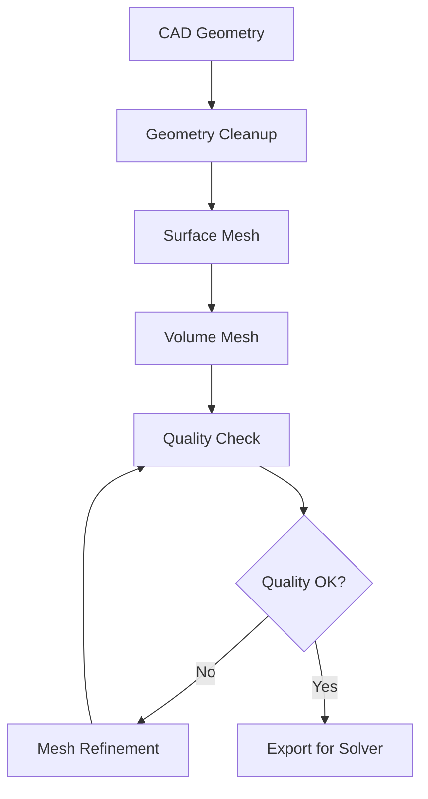

# 3D Mesh Generation Tools and Techniques

This guide covers various tools and methodologies for generating high-quality 3D meshes for CFD simulations. Understanding mesh generation is crucial for accurate and efficient computational analysis.

## Table of Contents

- [Mesh Types](#mesh-types)
- [Quality Metrics](#quality-metrics)
- [Open Source Tools](#open-source-tools)
- [Commercial Tools](#commercial-tools)
- [Best Practices](#best-practices)
- [Boundary Layer Meshing](#boundary-layer-meshing)
- [Mesh Adaptation](#mesh-adaptation)

## Mesh Types

### Structured Meshes
- **Definition**: Regular grid with clear i,j,k indexing
- **Advantages**: 
  - Higher accuracy per cell
  - Better convergence properties
  - Memory efficient
- **Disadvantages**:
  - Limited to simple geometries
  - Time-consuming for complex shapes
- **Applications**: Simple geometries, high-accuracy requirements

### Unstructured Meshes
- **Definition**: Irregular connectivity, typically tetrahedral/triangular
- **Advantages**:
  - Handle complex geometries easily
  - Automatic generation
  - Adaptive refinement
- **Disadvantages**:
  - More memory usage
  - Potential numerical diffusion
- **Applications**: Complex geometries, rapid prototyping

### Hybrid Meshes
- **Definition**: Combination of structured and unstructured elements
- **Advantages**:
  - Best of both worlds
  - Structured near walls, unstructured in bulk
  - Efficient for CFD
- **Applications**: External aerodynamics, turbomachinery

## Quality Metrics

### Essential Metrics

| Metric | Good Range | Description |
|--------|------------|-------------|
| **Aspect Ratio** | < 100 | Length/width ratio |
| **Skewness** | < 0.85 | Deviation from ideal shape |
| **Orthogonality** | > 30° | Angle between face normal and edge |
| **Volume Ratio** | < 20 | Adjacent cell size ratio |
| **Jacobian** | > 0 | Mesh validity indicator |

### Assessment Commands

```bash
# OpenFOAM mesh check
checkMesh -allTopology -allGeometry

# Gmsh quality assessment
gmsh -check mesh.msh

# ParaView mesh quality filter
# Filters -> Alphabetical -> Mesh Quality
```

## Open Source Tools

### 1. Gmsh
**Strengths**: 
- Excellent 3D meshing algorithms
- CAD integration
- Scripting capabilities
- Free and cross-platform

**Installation**:
```bash
# Ubuntu/Debian
sudo apt install gmsh

# From source
wget http://gmsh.info/src/gmsh-4.11.1-source.tgz
tar xzf gmsh-4.11.1-source.tgz
cd gmsh-4.11.1-source
mkdir build && cd build
cmake ..
make -j4
sudo make install
```

**Basic Usage**:
```bash
# Interactive GUI
gmsh

# Command line meshing
gmsh -3 geometry.geo -o mesh.msh

# Python API
python3 -c "import gmsh; gmsh.initialize(); gmsh.open('model.step'); gmsh.model.mesh.generate(3); gmsh.write('mesh.msh')"
```

### 2. Salome Platform
**Strengths**:
- Complete CAD-to-mesh workflow
- Advanced meshing algorithms
- Python scripting
- Integration with multiple solvers

**Installation**:
```bash
# Download from https://www.salome-platform.org/
wget https://files.salome-platform.org/Salome/Salome9.9.0/SALOME-9.9.0-native-UB20.04-SRC.tar.gz
tar xzf SALOME-9.9.0-native-UB20.04-SRC.tar.gz
cd SALOME-9.9.0-native-UB20.04-SRC
./salome
```

### 3. Netgen/NGSolve
**Strengths**:
- Excellent tetrahedral meshing
- Automatic mesh generation
- Integration with FEniCS

**Installation**:
```bash
# Ubuntu/Debian
sudo apt install netgen

# Pip installation
pip3 install netgen-mesher
```

### 4. TetGen
**Strengths**:
- Robust tetrahedral meshing
- Delaunay triangulation
- Quality mesh generation

**Usage**:
```bash
# Generate mesh from .poly file
tetgen -pq1.2a0.1 geometry.poly
```

### 5. CGAL Mesh Generation
**Strengths**:
- High-quality algorithms
- C++ library
- 2D/3D meshing

### 6. Meshlab
**Strengths**:
- Mesh processing and repair
- STL manipulation
- Surface reconstruction

## Commercial Tools (for Reference)

### High-End Solutions
- **ANSYS Meshing**: Industry standard, excellent automation
- **Altair HyperMesh**: Preprocessing powerhouse
- **Hexagon MSC Apex**: Modern meshing platform
- **Siemens Star-CCM+**: Integrated meshing and solving
- **Pointwise**: Specialist meshing tool

## Meshing Workflows

### Basic Workflow


### Example: Gmsh Workflow

#### 1. Geometry Creation
```cpp
// geometry.geo
Point(1) = {0, 0, 0, 0.1};
Point(2) = {1, 0, 0, 0.1};
Point(3) = {1, 1, 0, 0.1};
Point(4) = {0, 1, 0, 0.1};

Line(1) = {1, 2};
Line(2) = {2, 3};
Line(3) = {3, 4};
Line(4) = {4, 1};

Line Loop(1) = {1, 2, 3, 4};
Plane Surface(1) = {1};

Extrude {0, 0, 1} {
  Surface{1};
}
```

#### 2. Mesh Generation
```bash
# Generate 3D mesh
gmsh -3 geometry.geo

# With size field
gmsh -3 geometry.geo -clscale 0.5

# Export to different formats
gmsh geometry.msh -o mesh.vtk
gmsh geometry.msh -o mesh.unv
```

#### 3. Quality Assessment
```bash
# Check in Gmsh
gmsh mesh.msh -check

# Statistics
gmsh mesh.msh -info
```

## Boundary Layer Meshing

### Why Boundary Layers Matter
- Capture near-wall gradients
- Resolve viscous effects
- Critical for CFD accuracy

### Prismatic Layer Generation

#### Gmsh Approach
```cpp
// In .geo file
Field[1] = BoundaryLayer;
Field[1].EdgesList = {1, 2, 3, 4};  // Wall edges
Field[1].hfar = 0.1;
Field[1].hwall_n = 0.001;
Field[1].thickness = 0.01;
Field[1].ratio = 1.2;
Field[1].Quads = 1;
Background Field = 1;
```

#### Layer Parameters
- **First layer height**: y+ ≈ 1 for wall-resolved
- **Growth ratio**: 1.1-1.3 typical
- **Number of layers**: 10-20 for good resolution

### y+ Calculation
```
y+ = (y * u_tau) / nu
u_tau = sqrt(tau_wall / rho)
```

For y+ = 1:
```
y = nu / u_tau ≈ nu / (0.05 * U_inf) for flat plate
```

## Advanced Techniques

### Adaptive Mesh Refinement (AMR)
```cpp
// OpenFOAM refinement
refineMesh -dict system/refineMeshDict

// Error-based refinement
estimateScalarError
refineMesh -overwrite
```

### Mesh Morphing
```bash
# OpenFOAM mesh motion
moveDynamicMesh

# Gmsh parametric studies
gmsh -setnumber param 0.5 geometry.geo
```

### Parallel Meshing
```bash
# Gmsh parallel
mpirun -np 4 gmsh -3 -part 4 geometry.geo

# Domain decomposition
decomposePar -force
```

## Best Practices

### General Guidelines
1. **Start Simple**: Begin with coarse mesh, refine as needed
2. **Quality First**: Prioritize mesh quality over quantity
3. **Gradual Transitions**: Avoid sudden size changes
4. **Boundary Layers**: Essential for wall-bounded flows
5. **Validation**: Always verify mesh independence

### Size Guidelines
| Application | Typical Cell Count | y+ Range |
|-------------|-------------------|----------|
| Simple validation | 10K - 100K | 30-300 |
| Engineering analysis | 100K - 1M | 1-30 |
| Research/detailed | 1M+ | < 1 |

### Common Pitfalls
- **Over-meshing**: More cells ≠ better results
- **Poor transitions**: Sudden size changes cause errors
- **Neglecting boundaries**: Poor wall resolution
- **Ignoring quality**: High skewness causes convergence issues

## Mesh Generation Scripts

### Python Automation (Gmsh)
```python
import gmsh
import sys

gmsh.initialize()

# Parameters
lc = 0.1
length = 1.0
height = 0.5

# Geometry
gmsh.model.geo.addPoint(0, 0, 0, lc, 1)
gmsh.model.geo.addPoint(length, 0, 0, lc, 2)
gmsh.model.geo.addPoint(length, height, 0, lc, 3)
gmsh.model.geo.addPoint(0, height, 0, lc, 4)

# Lines
gmsh.model.geo.addLine(1, 2, 1)
gmsh.model.geo.addLine(2, 3, 2)
gmsh.model.geo.addLine(3, 4, 3)
gmsh.model.geo.addLine(4, 1, 4)

# Surface
gmsh.model.geo.addCurveLoop([1, 2, 3, 4], 1)
gmsh.model.geo.addPlaneSurface([1], 1)

# Synchronize
gmsh.model.geo.synchronize()

# Generate mesh
gmsh.model.mesh.generate(2)

# Save
gmsh.write("mesh.msh")
gmsh.finalize()
```

### Bash Automation
```bash
#!/bin/bash
# mesh_study.sh

# Parameters
SIZES=(0.1 0.05 0.025 0.0125)

for size in "${SIZES[@]}"; do
    echo "Generating mesh with size: $size"
    
    # Create geometry with size parameter
    sed "s/MESH_SIZE/$size/g" template.geo > current.geo
    
    # Generate mesh
    gmsh -3 current.geo -o "mesh_${size}.msh"
    
    # Convert for OpenFOAM
    gmshToFoam "mesh_${size}.msh"
    
    # Run simulation
    simpleFoam > "log_${size}"
    
    # Extract forces
    postProcess -func forceCoeffs -latestTime >> "forces_${size}.dat"
done
```

This comprehensive guide provides the foundation for effective 3D mesh generation across various tools and applications. The key is understanding the trade-offs between mesh quality, computational cost, and solution accuracy.
