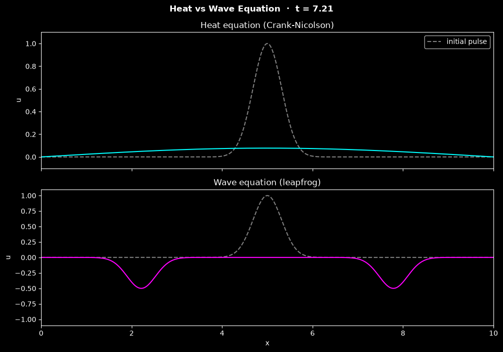

# 1D Heat and Wave Equation Simulations

This script solves the 1D heat equation with the implicit Crank–Nicolson scheme and the 1D wave equation with the explicit leapfrog scheme, animating both from the same initial Gaussian pulse. Showing them one above the other contrasts diffusion, where the pulse spreads and decays, with wave propagation, where it splits into two travelling pulses that reflect from the fixed ends.

## Overview

- Uses one uniform grid of `NX = 500` points on $0 \le x \le L$ with $L = 10$, and the same initial pulse $u(x,0) = e^{-5(x - L/2)^2}$ for both equations.
- Advances the heat equation (diffusivity `D = 1`) with Crank–Nicolson, using a sparse LU factorisation computed once.
- Advances the wave equation (speed `C = 1`) with the explicit leapfrog scheme, with a second-order start for a pulse at rest.
- Holds $u = 0$ at both ends (homogeneous Dirichlet conditions) for both equations.
- Sets one time step for both equations from the wave CFL limit (Courant number `COURANT = 0.9`) and rejects a Courant number above 1. At the end it prints the Courant number, $r = D\Delta t/\Delta x^2$ and both peaks.
- Runs to `T = 2L/c = 20`, one period of the wave: the two halves of the pulse reflect from both ends and recombine into the initial pulse, while the heat profile decays to about 2% of its initial peak.
- Animates the heat solution (cyan) above the wave solution (magenta) in two Matplotlib panels, each with the initial pulse as a dashed grey line.

## Mathematical Background

### Heat Equation

$$
\frac{\partial u}{\partial t} = D \frac{\partial^2 u}{\partial x^2}
$$

Crank–Nicolson averages the central second difference $\delta^2 u_i = u_{i+1} - 2u_i + u_{i-1}$ between time levels $n$ and $n+1$:

```math
u_i^{n+1} - \frac{r}{2}\,\delta^2 u_i^{n+1} = u_i^n + \frac{r}{2}\,\delta^2 u_i^n,
\qquad r = \frac{D\,\Delta t}{\Delta x^2}
```

The scheme is second-order accurate in time and space and unconditionally stable, so $r$ can be much larger than the explicit limit $r \le 1/2$. With the default grid $r \approx 45$.

### Wave Equation

$$
\frac{\partial^2 u}{\partial t^2} = c^2 \frac{\partial^2 u}{\partial x^2}
$$

The leapfrog scheme uses central differences in both time and space:

```math
u_i^{n+1} = 2u_i^n - u_i^{n-1} + C^2\,\delta^2 u_i^n,
\qquad C = \frac{c\,\Delta t}{\Delta x}
```

It is stable for $C \le 1$ (CFL condition). For a pulse at rest ($\partial u/\partial t = 0$), the first step uses $`u_i^{-1} = u_i^0 + \tfrac{1}{2}C^2\,\delta^2 u_i^0`$. The exact solution is $u = \tfrac{1}{2}[f(x - ct) + f(x + ct)]$ until the halves reach the boundaries, where they reflect with inverted sign.

## Implementation

- `make_grid` builds the grid and picks $\Delta t \le$ `COURANT` $\cdot \Delta x / c$ so that an integer number of steps reaches `T = 20`.
- `crank_nicolson_operators` assembles the sparse matrices $A = I - \tfrac{r}{2}\delta^2$ and $B = I + \tfrac{r}{2}\delta^2$ with identity boundary rows, and factorises $A$ with `scipy.sparse.linalg.splu`.
- `heat_step` solves $A u^{n+1} = B u^n$ and `wave_step` applies the leapfrog update. Both work in place.
- `initial_state` creates the Gaussian pulse and the second-order starting level for the wave.
- `HeatWaveSimulation` owns the heat and wave fields and the initial pulse, and caches the sparse factorization. `step()` advances both equations by one time step, `advance(n)` runs `n` steps without plotting, and `time` is the completed step count times `dt`. `default_steps` is the number of steps that reaches `total_time`. Grid, diffusivity, Courant number and total time can be passed to its constructor, and invalid values raise `ValueError`.
- `HeatWaveView` draws the two stacked panels, in the window and in a vertical reel alike, and only updates the two solution lines for each frame.
- `ANIMATION` and `main` use the shared runner in `scripts/_animation.py`, which provides the window, headless runs, the PNG and the reel. One frame is one time step, and the default `N_FRAMES = 1109` frames (the `default_steps` of the default grid) reach $t = T$.

## Usage

```bash
python main.py                                    # animate in a window up to t = 20 (space pauses)
python main.py --steps 555                        # stop at t = 10, when the inverted pulses meet
python main.py --no-show --output . --steps 400   # save the state at t = 7.2 as a PNG
python main.py --reel reel.mp4                    # 30 s vertical video for Shorts/Reels
```

`--steps N` sets the number of frames; each frame is one time step of $\Delta t \approx 0.018$. `--output DIR` saves `heat_and_wave_1d.png` in `DIR`.

## Output



The figure shows the state after 400 steps ($t \approx 7.2$), with the initial pulse dashed in both panels:

- **Heat** (top, cyan): the pulse has spread over the whole domain and its peak has fallen from 1 to 0.078. The fixed ends now draw heat out, so the profile decays towards zero.
- **Wave** (bottom, magenta): the pulse split into two half-amplitude pulses that moved apart at speed $c = 1$ and reflected from $x = 0$ and $x = L$ with inverted sign. They are now at $x \approx 2.2$ and $x \approx 7.8$, travelling back towards the centre.

Later in the run the two inverted pulses meet at the centre at $t = 10$ as one pulse of depth $-1$, pass through each other, reflect again, and recombine into the initial pulse at $t = 20$. By then the heat peak is down to about 0.02.

## Related Notes

- [Finite difference method](../../../notes/numerical/fdm/intro.md)
- [Finite difference discretization](../../../notes/numerical/fdm/discretization.md)
- [Numerical stability: explicit and implicit schemes](../../../notes/numerical/cfd/numerical_stability.md)
