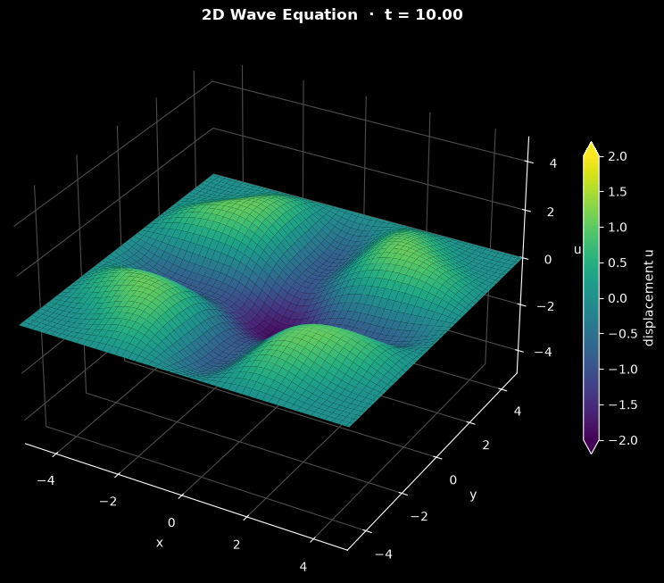

# 2D Wave Equation Simulation

This script solves the 2D scalar wave equation on a square domain with an explicit leapfrog finite difference scheme and animates the result as a 3D surface. The initial Gaussian bump is released from rest, spreads outward as a circular ring, and reflects from the fixed edges of the domain.

## Overview

- Uses a uniform $100 \times 100$ grid (`NX`, `NY`) on $[-L, L]^2$ with `L = 5`.
- Starts from a Gaussian pulse of amplitude `SCALE_FACTOR = 5` centred at the origin, with zero initial velocity.
- Advances the solution with the explicit leapfrog (central-in-time, central-in-space) scheme.
- Holds $u = 0$ on all four edges (Dirichlet boundary conditions), so the ring reflects with inverted sign.
- Takes the time step as half the 2D CFL limit.
- Animates the displacement as a 3D Matplotlib surface on a fixed height axis from $-5$ to $5$, coloured with viridis on a fixed scale from $-2$ to $2$ so the weaker reflected rings still show crests and troughs. The initial pulse, and the brief peaks where reflections focus (up to about $|u| = 4$), saturate this colour scale.

## Mathematical Background

The 2D wave equation for a scalar field $u(x, y, t)$ with wave speed $c$ is:

$$
\frac{\partial^2 u}{\partial t^2} = c^2
\left(\frac{\partial^2 u}{\partial x^2} + \frac{\partial^2 u}{\partial y^2} \right)
$$

### Finite Difference Discretization

With central differences in space and time, the explicit update is:

$$
u_{i,j}^{n+1} = 2u_{i,j}^n - u_{i,j}^{n-1} + (c\,\Delta t)^2
\left(\frac{u_{i+1,j}^n - 2u_{i,j}^n + u_{i-1,j}^n}{\Delta x^2} +
\frac{u_{i,j+1}^n - 2u_{i,j}^n + u_{i,j-1}^n}{\Delta y^2} \right)
$$

where $i$ indexes $x$ and $j$ indexes $y$. The scheme is second-order accurate in space and time.

### Stability (CFL Condition)

The scheme is stable when $c\,\Delta t\,\sqrt{1/\Delta x^2 + 1/\Delta y^2} \le 1$. For $\Delta x = \Delta y$ this becomes

$$
\Delta t \le \frac{\min(\Delta x, \Delta y)}{c\sqrt{2}}
$$

The code uses half of this limit, `dt = 0.5 * min(dx, dy) / (c * sqrt(2))`, which gives $\Delta t \approx 0.0357$ for $\Delta x = 0.101$.

### Initial Condition

$$
u(x, y, 0) = A \exp\left(-\frac{x^2 + y^2}{2}\right),
\qquad \frac{\partial u}{\partial t}(x, y, 0) = 0
$$

with $A = 5$. The initial pulse is set to zero on all boundary nodes. Zero initial velocity uses the second-order starting level $u^{-1} = u^0 + \tfrac{1}{2}(c\Delta t)^2\nabla_h^2 u^0$, so the first forward step contains half the discrete acceleration.

## Implementation

- `make_grid` builds the grid with `np.meshgrid`, so array axis 0 is $y$ and axis 1 is $x$, and computes `dt` from the CFL condition.
- `initial_condition` enforces the fixed edges and returns the second-order zero-velocity starting levels.
- `leapfrog_step` applies the update above to interior points and sets the boundary to zero.
- `WaveSimulation(length, nx, ny, c, cfl_safety)` holds the two time levels `u_prev` and `u`. `step()` performs one leapfrog step, `advance(n)` runs `n` of them without plotting, and `time` is the completed step count times `dt`. Invalid grid and CFL parameters raise `ValueError`.
- `WaveView` draws the state: it removes and re-plots the surface for each frame, with one shared `Normalize(-2, 2)` for the surface and the colour bar. In a vertical reel the colour bar sits below the surface and the 3D box is taller.
- `ANIMATION` and `main` use the shared runner in `scripts/_animation.py`, which provides the window, headless runs, the PNG and the reel. One frame is `STEPS_PER_FRAME = 4` leapfrog steps, and the default `N_FRAMES = 280` frames reach `T_END = 40`.

## Usage

```bash
python main.py                                    # animate in a window up to t = 40 (space pauses)
python main.py --steps 70                         # stop at t = 10
python main.py --no-show --output . --steps 70    # save the surface at t = 10 as a PNG
python main.py --reel reel.mp4                    # 30 s vertical video for Shorts/Reels
```

`--steps N` sets the number of frames; each frame is 4 leapfrog steps of $\Delta t \approx 0.0357$. `--output DIR` saves `wave_2d.png` in `DIR`.

## Output



The surface is shown after 70 frames ($t = 10$). Early in the run the bump becomes an outward-moving circular crest with a trough at the centre. Travelling at $c = 1$, the ring reaches the edges at $|x| = 5$ and $|y| = 5$ at about $t = 5$ and reflects with inverted sign. At $t = 10$ the reflected waves have returned to the centre and add up to a deep trough ($u \approx -1.86$), surrounded by four crests ($u \approx 1.06$) on the diagonals near $(\pm 2.6, \pm 2.6)$. For the rest of the run the reflections keep interfering in a changing pattern of crests and troughs.

## Related Notes

- [Finite difference method (including the CFL condition and 2D extensions)](../../../notes/numerical/fdm/intro.md)
- [Finite difference discretization](../../../notes/numerical/fdm/discretization.md)
- [Numerical stability: explicit and implicit schemes for the wave equation](../../../notes/numerical/cfd/numerical_stability.md)
