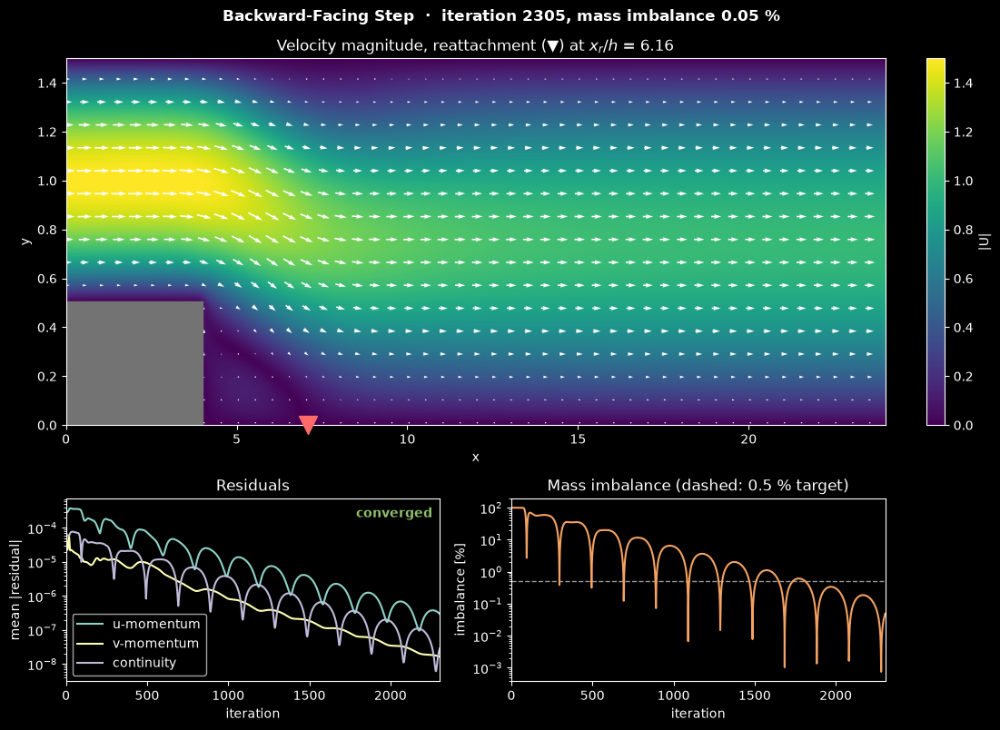

# Backward-Facing Step Flow (SIMPLE Algorithm)

This script solves steady 2D laminar incompressible flow over a backward-facing step with the finite volume method and the SIMPLE pressure–velocity coupling algorithm. The flow separates at the step corner, forms a recirculation zone behind the step, and reattaches downstream; the script animates the SIMPLE iterations as they converge, showing the velocity field and the convergence history, and prints the reattachment length at the end. The backward-facing step is a classic test case for separated flow, but this script does not compare its results with reference data.

## Overview

- Uses a 24 × 1.5 channel with a step of height `h = 0.5` and length `step_length = 4` at the lower left, so the inlet channel has height `H = 1` (expansion ratio 1.5).
- Solves on a staggered (MAC) grid of `nx × ny = 240 × 80` pressure cells, with first-order upwind convection and central-difference diffusion.
- Couples pressure and velocity with SIMPLE: momentum under-relaxation `alpha_u = 0.7`, pressure under-relaxation `alpha_p = 0.3`.
- Relaxes each linear system with Gauss–Seidel/SOR sweeps compiled with Numba: 2 momentum sweeps, and 40 pressure-correction sweeps with `omega_p = 1.7`.
- Applies a parabolic inlet profile with mean velocity 1, zero-gradient outflow with $p' = 0$ in the last cell column, and no-slip walls on the channel walls and the step.
- Tracks momentum and continuity residuals and the global mass imbalance, and stops when the solution meets the convergence criterion described below.
- Animates the outer iterations in a Matplotlib window (velocity magnitude with arrows and the reattachment point, residual history, mass imbalance), or runs them headless or as a vertical video, and prints the iteration count and the bottom-wall reattachment length $x_r/h$ at the end.

## Mathematical Background

### Governing Equations

Steady incompressible Navier–Stokes equations with density $\rho$ and viscosity $\mu$:

$$
\frac{\partial u}{\partial x} + \frac{\partial v}{\partial y} = 0
$$

$$
\rho
\left(u \frac{\partial u}{\partial x} + v \frac{\partial u}{\partial y}
\right) = -\frac{\partial p}{\partial x} + \mu
\left(\frac{\partial^2 u}{\partial x^2} + \frac{\partial^2 u}{\partial y^2} \right)
$$

$$
\rho
\left(u \frac{\partial v}{\partial x} + v \frac{\partial v}{\partial y}
\right) = -\frac{\partial p}{\partial y} + \mu
\left(\frac{\partial^2 v}{\partial x^2} + \frac{\partial^2 v}{\partial y^2} \right)
$$

The Reynolds number is based on the inlet channel height and mean inlet velocity, so the code sets $\mu = \rho U_{avg} H / Re$ with $Re = 200$:

$$
Re = \frac{\rho U_{avg} H}{\mu}
$$

### Finite Volume Discretisation

Integrating the $u$-momentum equation over the control volume around a $u$ face gives

$$
a_P u_P = a_E u_E + a_W u_W + a_N u_N + a_S u_S + (p_w - p_e)\,\Delta y
$$

where $p_w$ and $p_e$ are the pressures in the cells on either side of the face. With face mass fluxes $F$ (interpolated linearly from neighbouring velocities) and diffusion conductances $D_e = \mu\,\Delta y/\Delta x$ and $D_n = \mu\,\Delta x/\Delta y$, the first-order upwind coefficients are

$$
a_E = D_e + \max(-F_e, 0), \quad a_W = D_w + \max(F_w, 0), \quad a_N = D_n +
\max(-F_n, 0), \quad a_S = D_s + \max(F_s, 0)
$$

$$
a_P = a_E + a_W + a_N + a_S + (F_e - F_w + F_n - F_s)
$$

Where a no-slip wall lies half a cell from a velocity node, its conductance is doubled and the neighbour link removed. The $v$ equation is assembled the same way. Under-relaxation replaces $a_P$ by $a_P/\alpha_u$ and adds $\frac{1-\alpha_u}{\alpha_u} a_P u_P^{\text{old}}$ to the source term.

### SIMPLE Pressure Correction

1. Solve the momentum equations with the current pressure to get $u^*$ and $v^*$.
2. The velocity correction is $u'_e = d_e (p'_P - p'_E)$ with $d_e = \Delta y / a_e$. Substituting into continuity gives the pressure-correction equation

$$
a_P p'_P = \sum_{nb} a_{nb} p'_{nb} + b,
\qquad a_E = \rho\, d_e\,\Delta y, \quad a_N = \rho\, d_n\,\Delta x,
\qquad b = -\rho\left[(u^*_e - u^*_w)\Delta y + (v^*_n - v^*_s)\Delta x\right]
$$

with $p' = 0$ in the outlet column and no correction through solid or inlet faces.
3. Correct the velocities, $u = u^* + d_e(p'_P - p'_E)$, and the pressure, $p = p + \alpha_p p'$.

### Convergence Criterion

The momentum residual is the mean of $|b + \sum a_{nb}\phi_{nb} - a_P\phi_P|$, and the continuity residual is the mean $|b|$ of the pressure-correction equation. Iteration stops when all three residuals have fallen to $10^{-3}$ of their largest value in the first 10 iterations and the global mass imbalance $|\dot m_{in} - \dot m_{out}|/\dot m_{in}$ is at most 0.5%.

## Implementation

- `Params` holds the geometry, Reynolds number, relaxation factors and sweep counts. `build_geometry_masks` marks fluid pressure cells and $u$ and $v$ faces.
- `build_momentum_u` and `build_momentum_v` assemble the momentum coefficients, including the wall, inlet and outlet treatment. `gs_sor_scalar` performs the SOR sweeps, and `momentum_residual` computes the residual monitor.
- `apply_velocity_bcs` sets the inlet profile (`inlet_parabolic_profile`), the zero-gradient outlet $u$, wall and solid velocities, and a ±5 safety clamp.
- `build_pressure_correction` returns the $p'$ coefficients and the $d$ factors, and `correct_uvp` applies the corrections.
- `global_mass_imbalance` compares inlet and outlet flux. `reattachment_length` finds where $u$ in the first cell row changes sign from negative to positive behind the step.
- `BackwardStepSimulation` builds the masks, index arrays, coefficient arrays and initial fields from a `Params` instance. Its `step()` is one SIMPLE iteration (predictor, pressure correction, corrector, monitors); it appends the three residuals and the mass imbalance to the `residuals` and `imbalance` histories and marks the solver `done` once the convergence criterion holds, which stops every run. Its `time` is the iteration count.
- `BackwardStepView` draws the three panels from the simulation state only. The colour scale runs from 0 to the inlet peak speed $1.5\,U_{avg}$, and the arrow scale is fixed by the same speed (an arrow of that speed is 0.9 arrow spacings long), so every frame uses the same scales. Arrows are hidden inside the step, which is drawn in grey as resolved by the grid, and a red triangle on the bottom wall marks the reattachment point. The history axes are logarithmic and rescale to the data on every frame.
- The shared runner in `scripts/_animation.py` provides the window, the headless run, the PNG and the reel. In the vertical reel the 16:1 channel would be a thin strip, so the field panel is cropped to $2 \le x \le 12$ (the end of the inlet channel, the step, the recirculation zone and the recovery downstream) and stacked above the residual and mass-imbalance histories, which share the iteration axis.

## Usage

```bash
python main.py                                    # animate the iterations in a window (space pauses)
python main.py --nx 120 --ny 40                   # quick run on a coarser grid
python main.py --no-show --output . --steps 150   # save the converged state as a PNG
python main.py --reel reel.mp4                    # 30 s vertical video for Shorts/Reels
```

`--steps N` sets the number of frames (default 150, at most 3000 iterations); each frame is 20 SIMPLE iterations, and every run stops early once the convergence criterion is met.

- `--nx` and `--ny` set the number of pressure cells along and across the channel (default 240 × 80).
- `--no-show` runs without a window, `--output DIR` saves `backward_facing_step.png` in `DIR`, and `--reel FILE` renders a 1080 × 1920 MP4 instead of opening a window (`--reel-seconds`, `--reel-fps`).
- In the window, space pauses and the right arrow advances one frame; the animation stops when the solver converges.

On the default grid the solver converges after 2305 iterations (frame 116, about 25 s of solver time) with $x_r/h \approx 6.2$. On the 120 × 40 grid it converges after 680 iterations in a few seconds, with $x_r/h \approx 5.4$.

## Output



The image shows the converged state after 2305 iterations; the title gives the iteration count and the current mass imbalance (0.05 %).

- **Top panel**: velocity magnitude with arrows over the whole channel, with the vertical scale exaggerated about 7.5 times. The parabolic inlet jet (peak 1.5, yellow) leaves the step corner, spreads over the full channel height, and relaxes towards a wider parabolic profile of peak 1. The dark region behind the grey step is the recirculation zone, where the near-wall velocity reverses; the red triangle marks where it ends, $x_r/h = 6.16$ step heights downstream of the step, as given in the panel title.
- **Bottom left**: mean residuals of the $u$ and $v$ momentum equations and of continuity, on a log scale. Each falls below $10^{-3}$ of its maximum over the first 10 iterations, and the label "converged" appears once the criterion is met.
- **Bottom right**: global mass imbalance as a percentage of the inlet flux, with the 0.5 % target dashed. It stays near 100 % for the first 70 or so iterations, until the flow front reaches the outlet, and then decays in an oscillation with a period of about 200 iterations, which reflects how slowly pressure corrections propagate along the long channel.

During the animation the flow front advances down the channel in the first iterations, and the reattachment point then moves back and forth (between about 3 and 7 step heights) before settling at $x_r/h = 6.16$.

First-order upwind convection adds numerical diffusion, which tends to shorten the recirculation zone. Refine the grid before comparing the reattachment length with experimental or benchmark data.

## Related Notes

- [Finite volume discretization](../../../notes/numerical/fvm/discretization.md)
- [Navier–Stokes equations](../../../notes/fluid_mechanics/governing_equations/navier_stokes.md)
- [Iterative convergence and residuals](../../../notes/numerical/cfd/iterative_convergence.md)
- [Boundary layers and separation](../../../notes/fluid_mechanics/viscous_flow/boundary_layers.md)
