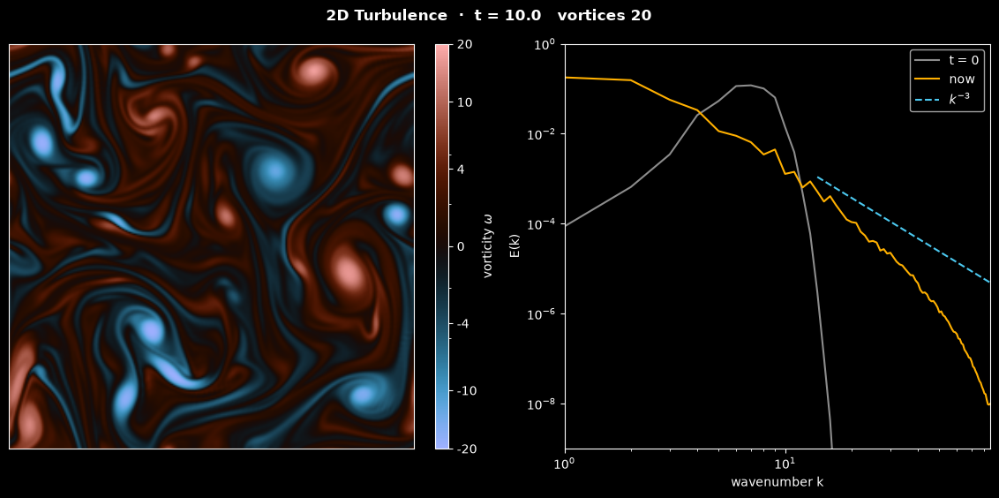

# Decaying 2D Turbulence

This script simulates freely decaying two-dimensional turbulence in a doubly periodic box and animates how a random vorticity field organises itself into coherent vortices that merge into ever larger ones. It solves the 2D vorticity equation with a pseudo-spectral method on a 256 × 256 grid, with 2/3-rule dealiasing and a fourth-order Runge-Kutta scheme that integrates the viscous terms exactly. The energy spectrum $E(k)$ is drawn next to the vorticity, so the inverse energy cascade is visible as its peak moving to small wavenumbers.

## Overview

- **Domain**: a doubly periodic square of side $2\pi$, so the wavenumbers are integers, on 256 × 256 collocation points. The units are dimensionless.
- **Initial state**: a random-phase vorticity field whose energy lies in a band of wavenumbers around $k_0 = 7$ (Gaussian, width 1.5), normalised to kinetic energy $E = 0.5$ (rms velocity 1). The random generator is seeded.
- **Dissipation**: a small viscosity $\nu = 10^{-4}$ plus a hyperviscosity $\nu_4 = 2 \times 10^{-7}$ (a $k^4$ damping) that removes enstrophy at the grid scale but barely touches the vortices.
- **Solver**: pseudo-spectral evaluation of the advection term, 2/3-rule dealiasing, and integrating-factor RK4 with $\Delta t = 0.005$.
- **Display**: the vorticity with the diverging `berlin` colour map (blue clockwise, red counter-clockwise, black at rest) on a fixed $\pm 20$ scale that is linear up to $|\omega| = 4$ and logarithmic-like beyond, so both the vortex cores and the weak filaments show. Next to it, the energy spectrum on log-log axes with the initial spectrum and a $k^{-3}$ reference line. The status line gives the time and the number of vortices. Each frame is 10 time steps, and the default 835 frames reach $t = 41.75$.
- **Reel**: `--reel FILE` renders the run as a 1080 × 1920 MP4 for YouTube Shorts or Instagram Reels, with the spectrum as a strip below the vorticity.

## Mathematical Background

### Vorticity Equation

In two dimensions the vorticity $\omega = \partial v/\partial x - \partial u/\partial y$ is a scalar. It is carried by the flow and only changes through dissipation:

$$
\frac{\partial \omega}{\partial t} + \mathbf{u}\cdot\nabla\omega = \nu\nabla^2\omega -
\nu_4\nabla^4\omega,
\qquad \nabla^2\psi = -\omega,
\qquad u = \frac{\partial \psi}{\partial y},
\qquad v = -\frac{\partial \psi}{\partial x}
$$

The streamfunction $\psi$ makes the velocity divergence-free. In Fourier space, with $k^2 = k_x^2 + k_y^2$,

```math
\frac{d\hat\omega_{\mathbf{k}}}{dt} = -D(k)\,\hat\omega_{\mathbf{k}} + \hat
N_{\mathbf{k}},
\qquad D(k) = \nu k^2 + \nu_4 k^4,
\qquad \hat\psi_{\mathbf{k}} = \frac{\hat\omega_{\mathbf{k}}}{k^2}
```

where $\hat N$ is the transform of $-\mathbf{u}\cdot\nabla\omega$.

### Two Invariants and the Inverse Cascade

Without dissipation, the 2D equations conserve both the energy and the enstrophy:

$$
E = \tfrac12\langle|\mathbf{u}|^2\rangle = \sum_k E(k),
\qquad Z = \tfrac12\langle\omega^2\rangle = \sum_k k^2 E(k)
$$

Both are sums over the same spectrum, but $Z$ weights each shell by $k^2$. When nonlinear interactions spread a band of energy over more wavenumbers, both sums can only stay fixed if most of the energy moves to smaller $k$ while the enstrophy moves to larger $k$. Energy therefore cascades to large scales, through vortex mergers, and enstrophy to small scales, through the stretching of filaments, where dissipation removes it. Kraichnan (1967) predicted a $k^{-3}$ spectrum for the enstrophy cascade. In decaying turbulence, coherent vortices form and survive for a long time (McWilliams, 1984), and their number falls as like-signed vortices merge (Carnevale et al., 1991).

With dissipation,

```math
\frac{dE}{dt} = -2\sum_k D(k)\, E(k) \le 0,
\qquad \frac{dZ}{dt} = -2\sum_k D(k)\, k^2 E(k) \le 0
```

so neither quantity can grow. Because $Z$ is dominated by large $k$, it decays much faster than $E$.

### Pseudo-Spectral Method and Dealiasing

The velocity and the vorticity gradient are computed in Fourier space, transformed to the grid, multiplied there, and transformed back. A product of modes $k_1$ and $k_2$ contains $k_1 + k_2$; on an $N$-point grid, wavenumbers beyond $N/2$ wrap around and appear as false (aliased) low wavenumbers. The 2/3 rule (Orszag, 1971) keeps only $|k_x|, |k_y| < N/3$ (here $\le 85$). Sums of two kept modes are below $2N/3$, so whatever wraps around lands above $N/3$ and is removed again. The kept modes then evolve exactly as in a Galerkin truncation, which conserves $E$ and $Z$ exactly in the inviscid limit. Without dealiasing the inviscid run becomes unstable.

### Integrating-Factor RK4 and Hyperviscosity

The damping $D(k)$ is stiff at large $k$. Multiplying by $e^{D t}$ removes it from the time step (Lawson, 1967): classical RK4 is applied to $e^{Dt}\hat\omega$, and with $h = e^{-D\Delta t/2}$ one step is

```math
\begin{aligned}
k_1 &= \hat N(\hat\omega^n), &
k_2 &= \hat N\!\left(h\,(\hat\omega^n + \tfrac{\Delta t}{2}k_1)\right), \\
k_3 &= \hat N\!\left(h\,\hat\omega^n + \tfrac{\Delta t}{2}k_2\right), &
k_4 &= \hat N\!\left(h^2\hat\omega^n + \Delta t\,h\,k_3\right), \\
\hat\omega^{n+1} &= h^2\hat\omega^n + \tfrac{\Delta t}{6}\left(h^2 k_1 + 2h\,k_2 + 2h\,k_3 + k_4\right).
\end{aligned}
```

The damping is integrated exactly, so a mode with $\hat N = 0$ decays as $e^{-D(k)t}$ for any $\Delta t$. The time step is limited only by advection: RK4 is stable for $|\mathbf{u}||\mathbf{k}|\Delta t < 2\sqrt2$, and with $|\mathbf{u}| \le 3.4$ (the largest speed in the default run) and $|\mathbf{k}| \le 85\sqrt2$ the step $\Delta t = 0.005$ gives at most 2.0.

The enstrophy cascade keeps feeding the smallest scales. Plain viscosity strong enough to absorb it at $k = 85$ would also dissolve the vortices: damping at $k = 85$ and at the vortex scale $k \approx 7$ differs by a factor $(85/7)^2 \approx 150$. With $k^4$ hyperviscosity the factor is $`(85/7)^4 \approx 22\,000`$. Here $D(85) = 11$ per time unit, while $D(7) = 0.005$ damps a mode at the vortex scale by only about 20 % over the whole run. Too little damping shows up as a pile-up of energy near $k = 85$ and grid-scale hatching in the vorticity map.

### Counting Vortices

The status line counts the connected regions where $|\omega| > 10$, half the colour limit, separately for each sign, joining regions that touch across the periodic edges. In the first few time units this also counts the fragments of stretched filaments, so the number rises before it falls.

## Implementation

- `wavenumbers`, `dealias_mask` and `spectral_weights` set up the Fourier grid of `scipy.fft.rfft2`, the 2/3-rule mask and the weights that turn half-plane sums into full sums.
- `initial_vorticity` builds the random band-limited field; `kinetic_energy`, `enstrophy` and `energy_spectrum` evaluate $E$, $Z$ and the shell-summed $E(k)$ by Parseval's theorem.
- `SpectralVorticitySolver(n, viscosity, hyperviscosity)` holds the wavenumbers, the mask and $D(k)$. `velocity` inverts the Poisson equation, `nonlinear` evaluates the dealiased advection term, and `step` performs one integrating-factor RK4 step.
- `TurbulenceSimulation(n, seed, viscosity, hyperviscosity, dt, omega_hat)` derives from the shared `Simulation` class in [`scripts/_animation.py`](../../_animation.py). It stores the Fourier coefficients and records `energy` and `enstrophy` after every step; `vorticity`, `spectrum()` and `count_vortices()` are computed from the current state.
- `TurbulenceView` shows the vorticity with `imshow` and the spectrum as a line that is updated in place. The panels sit side by side in the window and are stacked in a reel.
- Parameters are module constants: `INITIAL_ENERGY`, `PEAK_WAVENUMBER`, `BAND_WIDTH`, `VISCOSITY`, `HYPERVISCOSITY`, `SEED`, `GRID_SIZE`, `TIME_STEP`, `STEPS_PER_FRAME`, `N_FRAMES`, `VORTICITY_SCALE` and `VORTICITY_LINEAR_WIDTH`.

Unit tests check the solver:

- a Taylor-Green vortex $`\psi = \sin kx\,\sin ky`$, for which $\mathbf{u}\cdot\nabla\omega = 0$, decays as $e^{-2\nu k^2 t}$ to $10^{-12}$, and as $`e^{-D(\sqrt2 k)\,t}`$ with hyperviscosity;
- the advection term of $\psi = \sin x + \sin 2y$ equals the exact $6\cos x\cos 2y$;
- the dealiased product of two random fields equals the exact product truncated to the kept modes, while the removed band does contain aliasing errors;
- with dissipation, $E$ and $Z$ never increase from one step to the next; without it, both stay constant to $10^{-7}$ over 200 steps;
- the initial field has the requested energy and its spectral peak at $k_0$.

## Usage

```bash
python main.py                                    # animate in a window (space pauses)
python main.py --no-show --output . --steps 200   # save the frame at t = 10 as a PNG
python main.py --reel reel.mp4                    # 30 s vertical video for Shorts/Reels
```

`--steps N` sets the number of frames; each frame is 10 time steps of $\Delta t = 0.005$. A time step takes about 10 ms on a desktop CPU, so the default 8350 steps take about a minute and a half, and a 30 s reel renders in about 2 minutes.

## Output



The image shows the flow after 200 frames ($t = 10$):

- **Vorticity** (left): coherent vortices of both signs (the status line counts 20 regions with $|\omega| > 10$) with compact, nearly uniform cores, surrounded by thin filaments of vorticity stripped from them during mergers.
- **Energy spectrum** (right): the initial band around $k = 7$ (grey) has spread out. Most of the energy now sits at $k = 1$ to 2, which is the inverse cascade, while a tail reaches the dissipation range. The tail is steeper than the $k^{-3}$ reference line, as is usual in decaying 2D turbulence, where coherent vortices rather than a self-similar cascade dominate the small-scale structure.
- **Invariants**: by $t = 10$ the enstrophy has fallen from 25.6 to 5.1, while the energy has only fallen from 0.50 to 0.46.

The reel starts from the random field, which first tangles into filaments, then condenses into dozens of vortices that orbit each other and merge, until four vortices remain at the end of the run.

## Related Notes

- [The energy cascade, including two-dimensional turbulence](../../../notes/fluid_mechanics/turbulence/energy_cascade.md)
- [Turbulence](../../../notes/fluid_mechanics/turbulence/README.md)
- [Flow kinematics: rotation and vorticity](../../../notes/fluid_mechanics/flow_kinematics/flow_kinematics.md)
- [Numerical stability](../../../notes/numerical/cfd/numerical_stability.md)
