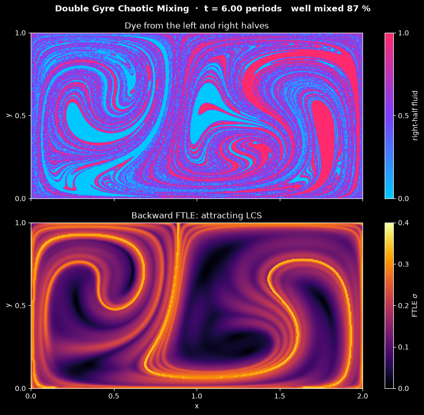

# Double Gyre Chaotic Mixing

This script advects 720 000 passive dye tracers through the time-periodic double gyre and animates how the flow stretches and folds them into ever finer filaments. Tracers from the left half of the box are cyan and those from the right half pink, so mixed fluid shows up violet. A second panel shows the backward-time finite-time Lyapunov exponent (FTLE), whose ridges are the Lagrangian coherent structures (LCS) along which the dye is drawn out. The flow is the standard test case of Shadden, Lekien and Marsden, *Definition and properties of Lagrangian coherent structures from finite-time Lyapunov exponents in two-dimensional aperiodic flows*, Physica D 212, 271–304 (2005).

## Overview

- **Flow**: two counter-rotating gyres fill the box $[0, 2] \times [0, 1]$, and the line between them sways from side to side with period 10. The parameters are those of Shadden et al.: $A = 0.1$, $\varepsilon = 0.25$ and $\omega = 2\pi/10$, all nondimensional. The velocity is an analytical formula, so it is exactly divergence-free and no fluid crosses the walls.
- **Tracers**: a 1200 × 600 lattice of cells, with one tracer at a random (seeded) point of each cell, 720 000 in all. Each tracer remembers the half it started in.
- **Integration**: the classical fourth-order Runge-Kutta method (RK4) with $\Delta t = 0.025$, 400 steps per forcing period, compiled with Numba and run in parallel over the tracers. A frame is 10 steps, and the default 240 frames cover six forcing periods.
- **Dye image**: instead of drawing 720 000 points, the tracers are counted on a 480 × 240 pixel grid, and each pixel shows the fraction of its tracers that came from the right half: cyan for 0, violet for 0.5 and pink for 1.
- **Mixing measure**: the fraction of the 40 × 20 cells of size 0.05 × 0.05 that are well mixed, meaning that between 25 % and 75 % of their tracers came from the right half. It is 0 % at the start, 17 % after 1.5 periods, 57 % after 3 and 87 % after 6.
- **FTLE panel**: the backward-time FTLE over 15 time units (1.5 periods) on a 320 × 160 grid. The velocity is periodic in time, so the FTLE field depends only on the forcing phase. The simulation computes it for 100 phases per period when they are first needed and reuses them in every later period. The panel shows the stored phase nearest to the current time, at most 0.05 time units away.
- **Reel**: `--reel FILE` renders the run as a 1080 × 1920 MP4 for YouTube Shorts or Instagram Reels, with the dye stacked above the FTLE as in the window.

## Mathematical Background

### Double Gyre

The flow has the stream function

```math
\psi(x, y, t) = A \sin\big(\pi f(x, t)\big) \sin(\pi y),
\qquad f(x, t) = a(t)\, x^2 + b(t)\, x
```

with $a(t) = \varepsilon \sin(\omega t)$ and $b(t) = 1 - 2\varepsilon \sin(\omega t)$. The velocity follows from the stream function:

```math
u = -\frac{\partial \psi}{\partial y} = -\pi A \sin(\pi f) \cos(\pi y),
\qquad v = \frac{\partial \psi}{\partial x} = \pi A \cos(\pi f) \sin(\pi y)\,
\frac{\partial f}{\partial x},
\qquad \frac{\partial f}{\partial x} = 2 a x + b
```

- **Incompressible**: $`\nabla \cdot \mathbf{u} = -\partial^2\psi/\partial x\,\partial y + \partial^2\psi/\partial y\,\partial x = 0`$ for any stream function.
- **Impermeable walls**: $f(0, t) = 0$ and $f(2, t) = 2$, so $u = 0$ on $x = 0$ and $x = 2$; $\sin(\pi y) = 0$ makes $v = 0$ on $y = 0$ and $y = 1$.
- **Swaying separatrix**: the line between the gyres is where $f = 1$. With $\varepsilon = 0.25$ it moves between $x \approx 0.76$ and $x \approx 1.24$ once per period $T = 2\pi/\omega = 10$.

With $\varepsilon = 0$ the flow is steady and each gyre is a closed set of streamlines, so no fluid ever crosses $x = 1$. The time dependence breaks the separatrix into intersecting stable and unstable manifolds, and in every period lobes of fluid are carried across between them. Repeated stretching and folding of these lobes is chaotic advection: nearby tracers separate exponentially fast even though the velocity field itself is smooth and laminar.

### Tracer Advection with RK4

Each tracer obeys $d\mathbf{x}/dt = \mathbf{u}(\mathbf{x}, t)$. One RK4 step of length $\Delta t$ from $t_n$ is

$$
\mathbf{k}_1 = \mathbf{u}(\mathbf{x}_n, t_n),
\qquad
\mathbf{k}_2 = \mathbf{u}\left(\mathbf{x}_n + \tfrac{\Delta t}{2}\mathbf{k}_1,\ t_n +
\tfrac{\Delta t}{2}\right),
\qquad
\mathbf{k}_3 = \mathbf{u}\left(\mathbf{x}_n + \tfrac{\Delta t}{2}\mathbf{k}_2,\ t_n +
\tfrac{\Delta t}{2}\right)
$$

```math
\mathbf{k}_4 = \mathbf{u}(\mathbf{x}_n + \Delta t\, \mathbf{k}_3,\ t_n + \Delta t),
\qquad \mathbf{x}_{n+1} = \mathbf{x}_n +
\frac{\Delta t}{6}\left(\mathbf{k}_1 + 2\mathbf{k}_2 + 2\mathbf{k}_3 +
\mathbf{k}_4\right)
```

The global error is $O(\Delta t^4)$. Because the flow is divergence-free, the flow map $\mathbf{x}(t_0) \mapsto \mathbf{x}(t)$ preserves area: the determinant of its Jacobian is 1. The dye can only be stretched and folded, never compressed, and the model has no diffusion. "Mixed" therefore means that both colours are present inside a 0.05 × 0.05 cell, not that they have blended at the molecular scale.

### Finite-Time Lyapunov Exponent

Let $\boldsymbol{\phi}_{t_0}^{t_0 + \tau}$ be the flow map over the interval $\tau$, $\mathbf{F} = \nabla \boldsymbol{\phi}$ its deformation gradient and $\mathbf{C} = \mathbf{F}^{\mathsf{T}} \mathbf{F}$ the Cauchy-Green tensor. The FTLE is the average exponential stretching rate

```math
\sigma(\mathbf{x}_0, t_0) = \frac{1}{2 |\tau|} \ln \lambda_{\max}(\mathbf{C}),
\qquad \lambda_{\max} = \frac{\mathrm{tr}\, \mathbf{C}}{2} +
\sqrt{\frac{(\mathrm{tr}\, \mathbf{C})^2}{4} - \det \mathbf{C}}
```

The code computes $\mathbf{F}$ with central differences of the flow map on the grid. Ridges of the forward-time FTLE ($\tau > 0$) are repelling LCS, the barriers that separate fluid going to different places. Ridges of the backward-time FTLE ($\tau < 0$, here $\tau = -15$) are attracting LCS: fluid released earlier gathers along them, so they are the curves that the dye filaments follow at time $t_0$.

### Mixing Measure

For each coarse cell $(i, j)$ with $`N^{L}_{ij}`$ tracers from the left half and $`N^{R}_{ij}`$ from the right half,

```math
c_{ij} = \frac{N^{R}_{ij}}{N^{L}_{ij} + N^{R}_{ij}},
\qquad M = \frac{\#\{(i, j) : 0.25 \le c_{ij} \le 0.75\}}{\#\{\text{cells}\}}
```

$M = 0$ while the halves are separated and $M = 1$ when every cell holds a fair share of both. With about 900 tracers per cell, sampling noise in $c_{ij}$ is about 0.02 and does not affect the count.

## Implementation

- `velocity(x, y, t)` evaluates the formulas above with Numba; it accepts scalars inside the integrator and arrays in the tests.
- `advect(x, y, t, dt, n_steps)` moves the points in place with RK4, in parallel over the points (`numba.prange`); a negative `dt` integrates backward.
- `seed_tracers` builds the jittered lattice. `count_tracers` counts tracers of each origin on any grid, `right_fraction` turns the counts into the dye image and `well_mixed_fraction` into $M$.
- `flow_map(x, y, t0, duration, max_step)` returns the end points of a copy of the given points. `ftle_from_flow_map` computes $\sigma$ from a gridded flow map, and `ftle_field(t0, duration, shape)` combines both on cell centres.
- `DoubleGyreSimulation(tracers, image_shape, ftle_shape, seed)` derives from the shared `Simulation` class in [`scripts/_animation.py`](../../_animation.py). It holds the tracer positions `x`, `y` and the label `from_right`; `step()` is one RK4 step. `dye()` and `mixed_fraction()` rasterise the current positions, and `ftle()` returns the backward FTLE at the nearest stored phase, computing and keeping it in `ftle_fields` the first time.
- `DoubleGyreView` stacks the dye and FTLE maps, both with fixed colour limits, and updates them with `set_data`. Two 2:1 maps on top of each other fill both the window and the nearly square reel panel.
- Parameters are module constants: `AMPLITUDE`, `EPSILON`, `PERIOD`, `TRACER_GRID`, `TIME_STEP`, `STEPS_PER_FRAME`, `N_FRAMES`, `IMAGE_SHAPE`, `MIXING_CELLS`, `MIXED_RANGE`, `FTLE_SHAPE`, `FTLE_TIME`, `FTLE_STEP`, `FTLE_PHASES` and `FTLE_MAX`.

## Usage

```bash
python main.py                                    # animate in a window (space pauses)
python main.py --no-show --output . --steps 240   # save the final frame as a PNG
python main.py --reel reel.mp4                    # 30 s vertical video for Shorts/Reels
```

`--steps N` sets the number of frames; each frame is 10 RK4 steps of $\Delta t = 0.025$, a quarter of a time unit. On a 20-thread desktop CPU the default 240 frames take about 45 s headless and 2 to 3 minutes as a reel; Numba uses every core it finds.

## Output



The image shows the default run after six forcing periods ($t = 60$):

- **Dye** (top): the two halves have been stretched into interleaved cyan and pink filaments that spiral around both gyre centres. Most of the box is violet, where filaments are thinner than a pixel and both colours share a cell: 87 % of the 0.05 × 0.05 cells are well mixed. Larger cyan and pink patches remain near the gyre centres and in the right gyre, where stretching is slower.
- **Backward FTLE** (bottom): bright ridges at $\sigma \approx 0.3$ to $0.37$ mark the attracting LCS at this phase, an S-shaped curve through the right gyre, a spiral in the left gyre and a line that drops from the top wall near $x = 0.9$. The edges of the cyan and pink filaments in the top panel follow the same curves. Dark regions inside the gyres stretch slowly.

In longer runs most of the box turns violet, but a few small islands near the gyre centres keep their original colour: they are regular (non-chaotic) regions of the periodic flow that exchange no fluid with the chaotic sea around them. The window title and the reel show the time in forcing periods and the well-mixed fraction $M$.

The reel starts with the box split into a cyan and a pink half. During the first period, lobes of each colour cross the swaying separatrix into the other gyre; by three periods the lobes have been folded into thin filaments; and the reel ends at six periods with the box mostly violet. Meanwhile the FTLE ridges sway back and forth once per period.

## Related Notes

- [Eulerian and Lagrangian descriptions of flow](../../../notes/fluid_mechanics/flow_kinematics/eulerian_lagrangian_flows.md)
- [Flow kinematics: pathlines and deformation](../../../notes/fluid_mechanics/flow_kinematics/flow_kinematics.md)
- [Continuity equation](../../../notes/fluid_mechanics/governing_equations/continuity.md)
- [Potential flow and the stream function](../../../notes/fluid_mechanics/inviscid_flow/potential_flow.md)
