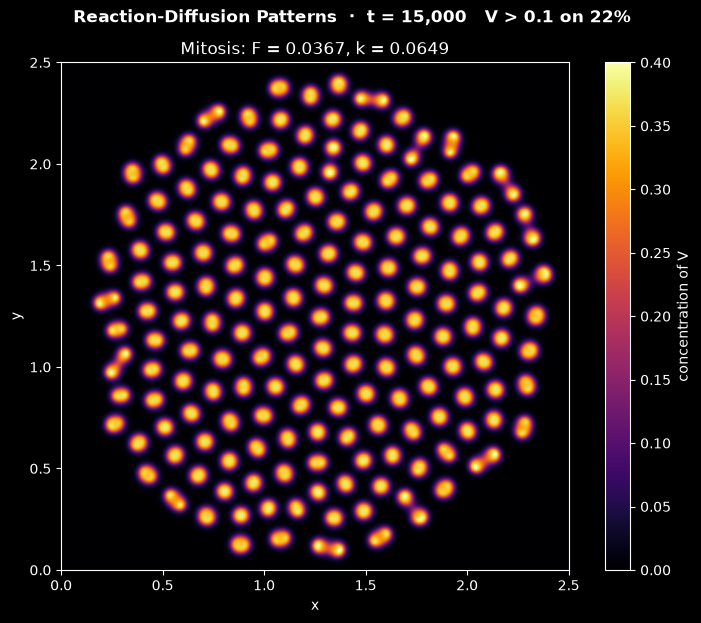

# Gray-Scott Reaction-Diffusion Simulation

This script simulates the Gray-Scott reaction-diffusion system, in which two chemicals that react and diffuse on a periodic square turn a small seeded square into self-replicating spots or branching coral, and animates the concentration of one of them with Matplotlib. It uses the diffusivities, domain size and seeded initial square of Pearson (1993), "Complex patterns in a simple system", *Science* 261, 189–192, and advances the equations with explicit Euler and the periodic 5-point Laplacian.

## Overview

- **Chemistry**: the autocatalytic reaction $U + 2V \to 3V$ and the decay $V \to P$ to an inert product. $U$ is fed in from a reservoir at rate $F$, and $V$ is removed at rate $F + k$.
- **Grid**: 256 × 256 periodic cells (`GRID_SIZE`) of size $h = 2.5/256$, so the domain is 2.5 × 2.5, with diffusivities $D_u = 2\times10^{-5}$ and $D_v = 10^{-5}$ in Pearson's dimensionless units.
- **Initial state**: $(U, V) = (1, 0)$ everywhere except a central 20 × 20 square at $(1/2, 1/4)$. Uniform noise in $[-0.01, 0.01]$ (seed `SEED = 0`) is added to both fields, which are then clipped to $[0, 1]$.
- **Patterns** (`--pattern`):
  - `mitosis` (default), $F = 0.0367$, $k = 0.0649$: spots grow, split in two, and the daughters push outwards until they tile the domain;
  - `coral`, $F = 0.0545$, $k = 0.062$: stripes grow outwards and branch until they fill the domain with a labyrinth.
- **Scheme**: explicit Euler with $\Delta t = 1$ and the periodic 5-point Laplacian, vectorised with `numpy.roll`.
- **Display**: $V$ with the `inferno` colour map on the fixed range $[0, 0.4]$, so the unreacted state is black. The status line shows the time and the fraction of cells with $V > 0.1$. The default run is 250 frames of 100 time steps ($`t = 25\,000`$).
- **Reel**: `--reel FILE` renders the run as a 1080 × 1920 MP4 for YouTube Shorts or Instagram Reels.

## Mathematical Background

### Reaction-Diffusion Equations

The Gray-Scott model (Gray and Scott, 1983, *Chemical Engineering Science* 38, 29–43) describes the concentrations $u$ and $v$ of $U$ and $V$:

```math
\frac{\partial u}{\partial t} = D_u\nabla^2 u - u v^2 + F(1 - u),
\qquad \frac{\partial v}{\partial t} = D_v\nabla^2 v + u v^2 - (F + k)\, v
```

- $u v^2$ is the rate of the autocatalytic step $U + 2V \to 3V$: $V$ makes more of itself by consuming $U$.
- $F(1 - u)$ feeds $U$ from a reservoir at concentration 1.
- $`(F + k)\,v`$ removes $V$ by outflow (rate $F$) and by decay to the product $P$ (rate $k$).

$U$ diffuses twice as fast as $V$. Where $V$ is high it consumes $U$ faster than diffusion brings it in, so $V$ can only grow at the rim of a spot, where fresh $U$ arrives. A spot that grows too large starves in the middle and splits in two, which is the self-replication seen in the `mitosis` pattern.

### Homogeneous Steady States

The unreacted state $(u, v) = (1, 0)$ is a steady state for every $F$ and $k$. Other uniform steady states satisfy $u v = F + k$ and $(F + k)v^2 - F v + F(F + k) = 0$, so

$$
v_\pm = \frac{F \pm \sqrt{F^2 - 4F(F + k)^2}}{2(F + k)},
\qquad u_\pm = \frac{F + k}{v_\pm}
$$

These exist only when $F \ge 4(F + k)^2$. For `mitosis`, $4(F + k)^2 = 0.0413 > F$, so $(1, 0)$ is the only uniform state and the spots are localised structures on top of it. For `coral`, $F = 0.0545$ is just above $4(F + k)^2 = 0.0543$.

### Discretisation

On the periodic grid, with indices wrapped around the edges,

$$
\nabla_h^2
f_{i,j} = \frac{f_{i+1,j} + f_{i-1,j} + f_{i,j+1} + f_{i,j-1} - 4f_{i,j}}{h^2}
$$

and both fields are advanced with explicit Euler:

```math
u^{n+1} = u^n + \Delta t\left[D_u\nabla_h^2 u^n - u^n (v^n)^2 + F(1 - u^n)\right],
\qquad v^{n+1} = v^n + \Delta
t\left[D_v\nabla_h^2 v^n + u^n (v^n)^2 - (F + k)\, v^n\right]
```

Summed over a periodic grid the stencil gives zero, so diffusion alone conserves the total amount of each chemical. The Fourier mode $e^{2\pi i(m x + l y)/(N h)}$ on an $N \times N$ grid is an eigenfunction of $\nabla_h^2$:

$$
\lambda_{m,l} = -\frac{4}{h^2}\left[\sin^2 \frac{\pi m}{N} + \sin^2
\frac{\pi l}{N}\right],
\qquad - \frac{8}{h^2} \le \lambda_{m,l} \le 0
$$

### Stability of the Explicit Scheme

Linearised about $(1, 0)$, every Fourier mode of $u$ is multiplied by $`1 + \Delta t\,(D_u\lambda - F)`$ per step, and every mode of $v$ by $`1 + \Delta t\,(D_v\lambda - F - k)`$. Both factors stay within $[-1, 1]$ for the checkerboard mode $\lambda = -8/h^2$ when

$$
\Delta t \le \min\left(\frac{2}{8D_u/h^2 + F},\ \frac{2}{8D_v/h^2 + F + k}\right)
$$

which is $1.17$ for `mitosis` and $1.15$ for `coral`. The time step $\Delta t = 1$ is below both, and also satisfies the pure-diffusion limit $D_u\Delta t/h^2 = 0.21 \le 1/4$. Inside the spots the decay rate of $u$ rises to $F + v^2$; with $v \le 0.45$ the same estimate still allows $\Delta t \le 1.03$.

## Implementation

- `laplacian(field, h)` is the periodic 5-point stencil and `laplacian_eigenvalue(mode_x, mode_y, n, h)` its eigenvalue $\lambda_{m,l}$.
- `reaction(u, v, feed, kill)` returns the two reaction terms, and `euler_step(u, v, feed, kill, h, dt)` advances both fields by one time step.
- `homogeneous_states(feed, kill)` returns $(1, 0)$ and, when they exist, $(u_\pm, v_\pm)$. `stability_limit(feed, kill, h)` returns the largest stable $\Delta t$ derived above.
- `seed_fields(n, rng)` builds the seeded square with noise.
- `GrayScottSimulation(n, pattern, seed)` derives from the shared `Simulation` class in [`scripts/_animation.py`](../../_animation.py). It holds `u` and `v` on an `n` × `n` grid of spacing `GRID_SPACING`, so smaller grids show a smaller patch of the same system. `step()` is one `euler_step`, and `covered_fraction` is the fraction of cells with $V >$ `COVER_THRESHOLD`.
- `GrayScottView` shows $V$ with `imshow` (`interpolation="bilinear"`) and a colour bar, and updates the image without advancing the solver. `ANIMATION.run` uses it for the window, the `--output` PNG and the `--reel` video.
- Parameters are module constants: `DIFFUSIVITY_U`, `DIFFUSIVITY_V`, `PATTERNS`, `GRID_SIZE`, `GRID_SPACING`, `TIME_STEP`, `SEED_SIZE`, `NOISE_AMPLITUDE`, `STEPS_PER_FRAME` and `N_FRAMES`.

## Usage

```bash
python main.py                                    # animate in a window (space pauses)
python main.py --pattern coral --steps 150        # branching coral instead of dividing spots
python main.py --no-show --output . --steps 150   # save the frame at t = 15 000 as a PNG
python main.py --reel reel.mp4                    # 30 s vertical video for Shorts/Reels
```

`--steps N` sets the number of frames; each frame is 100 time steps of $\Delta t = 1$. The `mitosis` spots fill the domain at about $`t = 22\,000`$ (frame 220), the `coral` stripes already at about $`t = 12\,000`$ (frame 120), after which the labyrinth barely changes.

## Output



The image shows the default `mitosis` pattern after 150 frames ($`t = 15\,000`$):

- **Spots**: about 170 round spots of $V$ (orange to yellow, peak $V \approx 0.4$) on the unreacted background ($V = 0$, black), filling a disc of radius 1.2 around the seed.
- **Division**: at the rim of the disc many spots are elongated or already split into pairs. The daughters move apart and divide again, so the radius of the disc grows at an almost constant rate of about 0.08 per 1000 time steps.
- **Interior**: behind the rim the spots stop dividing and settle into a nearly hexagonal arrangement, about 0.16 apart.

The reel follows the whole run: the seeded square breaks into four spots by $t = 1000$, which keep dividing into rings that expand until about 290 spots tile the periodic domain at $`t \approx 22\,000`$, with $V > 0.1$ on 32% of it.

## Related Notes

- [Finite difference method](../../../notes/numerical/fdm/intro.md)
- [Discretization using the finite-difference method](../../../notes/numerical/fdm/discretization.md)
- [Numerical stability](../../../notes/numerical/cfd/numerical_stability.md)
