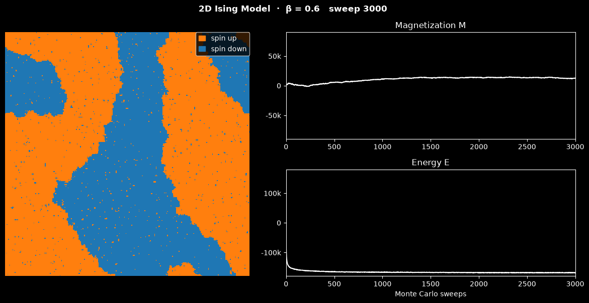

# Ising Model Simulation

This script simulates the two-dimensional Ising model with the Metropolis Monte Carlo algorithm and animates the spin lattice together with its magnetization and energy. With the default inverse temperature $\beta = 0.6$, which is below the critical temperature, a random start coarsens into large ordered domains of up and down spins.

## Overview

- Uses a 300×300 lattice (`N_ROWS`, `N_COLS`) of spins $s_i = \pm 1$ with periodic boundaries, $J = 1$ and $k_B = 1$.
- Starts from a random configuration drawn with a seeded generator (`SEED = 0`, which also seeds Numba's generator), then runs `WARMUP_STEPS = 1` sweep before sweep 0.
- Performs Metropolis sweeps at `BETA = 0.6`. Each sweep makes $N = 90{,}000$ single-spin-flip attempts at random sites. The default run is `N_FRAMES = 600` frames of `STEPS_PER_FRAME = 5` sweeps, 3000 sweeps in total.
- Numba-compiles (`@njit`) the Metropolis sweep and the energy and magnetization sums.
- Records $M$ and $E$ after every sweep. These sums cost about 1% of a sweep.
- Draws the lattice and the $M$ and $E$ histories with Matplotlib after every frame.

## Mathematical Background

### Hamiltonian

$$
H = -J \sum_{\langle i,j \rangle} s_i s_j
$$

The sum runs over nearest-neighbour pairs, each counted once. The code uses $J = 1$ (ferromagnetic) and counts each bond once by summing only the right and lower neighbours of every site. Energies therefore lie between $-2N$ (all spins aligned) and $+2N$.

### Magnetization

$$
M = \sum_i s_i,
\qquad - N \le M \le N
$$

$|M| \approx N$ in a fully ordered state. $M \approx 0$ in the disordered (paramagnetic) phase, and also in an ordered state split into equal up and down domains.

### Metropolis Criterion

Flipping spin $s_i$ changes the energy by

$$
\Delta E = 2 J s_i \sum_{j \in \text{nn}(i)} s_j
$$

The flip is accepted with probability

$$
A = \begin{cases} 1 & \Delta E \le 0 \\ e^{-\beta\Delta E} & \Delta E > 0 \end{cases}, \qquad \beta = \frac{1}{k_B T}
$$

### Phase Transition

In the thermodynamic limit, the 2D Ising model on a square lattice has its critical point at $\beta_c = \tfrac{1}{2}\ln(1 + \sqrt{2}) \approx 0.4407$ ($T_c \approx 2.269$). For $\beta > \beta_c$ (low temperature) the equilibrium state is ordered with spontaneous magnetization; for $\beta < \beta_c$ it is disordered. At $\beta = 0.6$ the single-flip dynamics coarsen domains slowly, so after 3000 sweeps a 300×300 lattice usually still contains several large domains separated by domain walls.

## Implementation

- `initialize_lattice(n_rows, n_cols, rng)` returns a random `int8` lattice of $\pm 1$.
- `seed_numba(seed)` seeds Numba's random generator, which is separate from NumPy's.
- `metropolis_step_numba(lattice, beta)` performs one sweep in place.
- `calculate_energy_numba` and `calculate_magnetization_numba` compute $E$ and $M$.
- `IsingSimulation` holds the lattice and the `magnetization` and `energy` lists. Its constructor seeds both generators, draws the lattice and runs the warm-up sweep; `step()` performs one sweep and appends $M$ and $E$.
- `IsingView` draws the lattice (orange for $+1$, blue for $-1$) next to the magnetization and energy panels. In the vertical reel the lattice is on top with the two panels side by side below it.
- `main` runs the shared animation runner from `scripts/_animation.py`: a window, a headless run with `--no-show`, or a reel with `--reel`.

## Usage

```bash
python main.py                                    # animate in a window (space pauses)
python main.py --steps 100                        # a shorter run: 500 sweeps
python main.py --no-show --output . --steps 600   # save the final frame as a PNG
python main.py --reel reel.mp4                    # 30 s vertical video for Shorts/Reels
```

`--steps N` sets the number of frames; each frame is 5 Monte Carlo sweeps.

Lattice size, `BETA` and `STEPS_PER_FRAME` are constants at the top of `main.py`. Try `BETA = 0.44` to watch critical fluctuations, or `BETA = 0.3` for a disordered lattice.

## Output

The frame below is from a short video of an earlier version of the script:

[](https://youtube.com/shorts/aIUKwLx_Kj8?feature=share)

The figure below shows the final frame of the default run (600 frames, 3000 sweeps):



- **Lattice** (left): spin-up ($+1$) sites are orange and spin-down ($-1$) sites blue. Large domains have formed, with isolated flipped spins from thermal fluctuations inside them.
- **Magnetization** (top right): $M$ stays well below $\pm N$ because up and down domains coexist. It ends near $0.14\,N$.
- **Energy** (bottom right): the random start has $E \approx 0$, and the warm-up sweep already lowers it to about $-0.7\,N$ at sweep 0. $E$ then drops quickly during the first hundred sweeps as domains form, and decreases slowly afterwards as domain walls shorten. It ends near $-1.88\,N$.

The title line shows $\beta$ and the sweep number. When the run ends the program prints $M/N$ and $E/N$ of the final sweep.

## Related Notes

The Ising model is a statistical-mechanics topic, and no note in this repository covers Monte Carlo methods for it.
