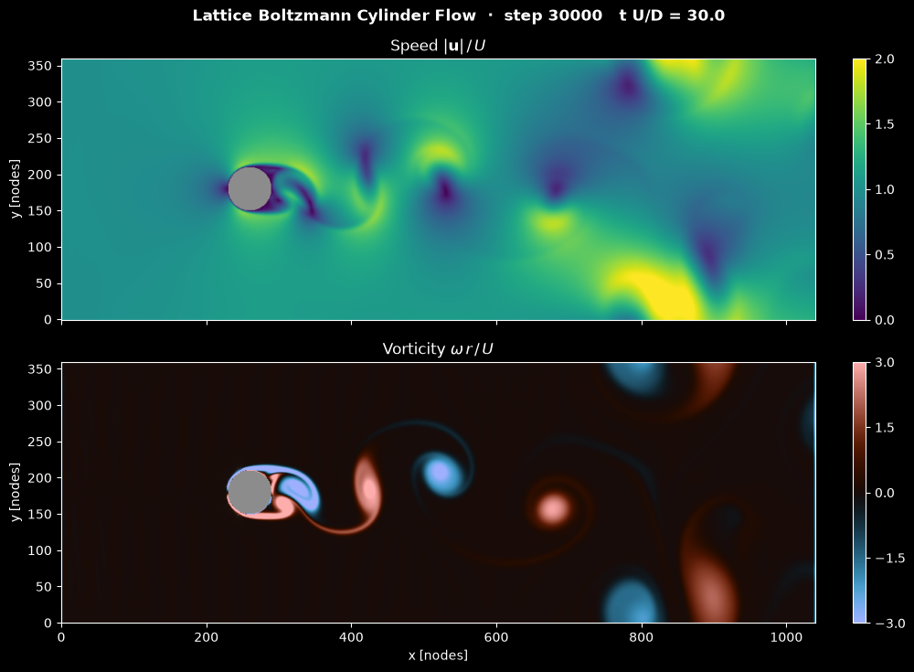

# Lattice Boltzmann Cylinder Flow Simulation

This script simulates 2D flow past a circular cylinder with the lattice Boltzmann method (D2Q9 lattice, BGK collision operator) and animates the velocity magnitude and the vorticity with Matplotlib. The lattice Boltzmann method evolves particle distribution functions on a regular lattice instead of the macroscopic variables, and it recovers the incompressible Navier-Stokes equations at low Mach number. A short demonstration is on YouTube: [](https://youtu.be/Jzsxy2BsQRM)

## Overview

- **Lattice**: 1040 × 360 nodes (`LATTICE_DIMENSIONS`), in lattice units where $\Delta x = \Delta t = 1$.
- **Cylinder**: radius $r = 30$ centred at $(260, 180)$.
- **Flow parameters**: inflow speed $U = 0.06$ (Mach number $U/c_s = 0.10$) and $Re = Ur/\nu = 350$ based on the radius (700 based on the diameter). This gives $\nu = 0.00514$ and relaxation parameter $\omega = 1.940$ ($\tau = 0.515$).
- **Scheme**: D2Q9 velocity set with the single-relaxation-time BGK collision.
- **Boundaries**:
  - inlet at $x = 0$: Zou/He velocity boundary with a uniform velocity carrying a $10^{-4}$ sinusoidal perturbation in $y$ that breaks the symmetry;
  - outlet at $x = n_x - 1$: zero-gradient;
  - top and bottom: periodic;
  - cylinder: full-way bounce-back (no slip).
- **Initial state**: equilibrium populations with the inflow velocity everywhere.
- **Visualisation**: two stacked colour maps with fixed ranges, the speed $|\mathbf{u}|/U$ on $[0, 2]$ and the vorticity $\omega r/U$ on $[-3, 3]$, with the cylinder in grey. The image is updated every 10 time steps, and the default 3000 frames give 30 000 time steps. The window, the PNG and the reel all show the flow from left to right: stacking the two 2.9:1 maps fills the nearly square panel of a vertical reel, while a single map, rotated or not, would leave two thirds of it empty.

## Mathematical Background

### Lattice Boltzmann BGK Equation

The distribution functions $f_i$ of the discrete velocities $\mathbf{c}_i$ are streamed and relaxed towards equilibrium:

```math
f_i(\mathbf{x} + \mathbf{c}_i,\, t + 1) = f_i(\mathbf{x}, t) -
\omega\left(f_i(\mathbf{x}, t) - f_i^{eq}(\mathbf{x}, t)\right)
```

### D2Q9 Equilibrium and Moments

```math
f_i^{eq} = w_i\,\rho\left(1 + 3\,\mathbf{c}_i\cdot\mathbf{u} +
\frac{9}{2}(\mathbf{c}_i\cdot\mathbf{u})^2 - \frac{3}{2}|\mathbf{u}|^2\right),
\qquad \rho = \sum_i f_i,
\qquad \rho\,\mathbf{u} = \sum_i f_i\,\mathbf{c}_i
```

The weights are $w_0 = 4/9$ for the rest velocity, $1/9$ for the four axis directions and $1/36$ for the four diagonals. The lattice speed of sound is $c_s = 1/\sqrt3$.

### Viscosity and Reynolds Number

$$
\nu = c_s^2\left(\tau - \tfrac12\right) = \frac{1}{3}\left(\frac{1}{\omega} -
\frac12\right) \quad\Rightarrow\quad \omega = \frac{1}{3\nu + 1/2},
\qquad \nu = \frac{U r}{Re}
$$

### Boundary Conditions

- **Zou/He inlet**: the velocity $\mathbf{u}$ is prescribed. The density follows from the known populations, and the unknown populations (those with $c_{ix} > 0$) are set by bouncing back the non-equilibrium part of their opposite $\bar\imath$:

  ```math
  \rho = \frac{\sum_{c_{ix}=0} f_i + 2\sum_{c_{ix}<0} f_i}{1 - u_x},
  \qquad f_i = f_i^{eq} + f_{\bar\imath} - f_{\bar\imath}^{eq}
  ```

- **Outlet**: the populations with $c_{ix} < 0$ at the last column are copied from the column before it.

- **Bounce-back**: at nodes inside the cylinder the post-collision populations are reversed, $f_i^{out} = f_{\bar\imath}^{in}$, which gives a no-slip wall on a staircase approximation of the circle.

### Vorticity

The vorticity is computed from the velocity of the streamed populations by central differences (one-sided at the edges of the lattice):

$$
\omega = \frac{\partial u_y}{\partial x} - \frac{\partial u_x}{\partial y}
$$

Positive values (red) turn counter-clockwise, negative values (blue) clockwise. It is shown in units of $U/r$.

### Accuracy and Stability

- The BGK model recovers the Navier-Stokes equations with compressibility errors of order $Ma^2$, about 1% here.
- With $\tau = 0.515$ the BGK collision is close to its stability limit $\tau \to 1/2$. Raising $Re$ further, or lowering the resolution, can make the simulation blow up.

## Implementation

- `compute_density`, `compute_velocity` and `equilibrium` evaluate the moments and $f^{eq}$ with vectorised `numpy.einsum`.
- `make_obstacle` returns the cylinder mask. `make_inflow_velocity` builds the perturbed inflow profile.
- `lbm_step(fin, obstacle, inflow_velocity, relaxation)` performs one step in place: outflow condition, moments, Zou/He inlet, BGK collision with the supplied relaxation rate, bounce-back (`NOSLIP` gives the opposite directions), and streaming with `np.roll`.
- `LatticeBoltzmannSimulation(dimensions)` owns the populations, inlet profile, obstacle, and step counter; smaller grids can be used for numerical checks. `step()` is one `lbm_step`, and `advance(steps)` repeats it without plotting. `speed` and `vorticity` are computed from the current populations, with NaN inside the cylinder.
- `LatticeBoltzmannView` shows the speed above the vorticity with `imshow`; in a reel the colour bars sit below the maps.
- Parameters are module constants: `REYNOLDS_NUMBER`, `LATTICE_DIMENSIONS`, `CYLINDER_RADIUS`, `VELOCITY_LATTICE_UNITS`, `STEPS_PER_FRAME`, `N_FRAMES` and `VORTICITY_SCALE`.

## Usage

```bash
python main.py                                    # animate 3000 frames in a window (space pauses)
python main.py --steps 1000                       # shorter run: the wake is still symmetric
python main.py --no-show --output . --steps 3000  # save the final frame as a PNG
python main.py --reel reel.mp4                    # 30 s vertical video for Shorts/Reels
```

`--steps N` sets the number of frames; each frame is 10 lattice Boltzmann time steps. The symmetric recirculation bubble behind the cylinder becomes unstable slowly: the wake starts oscillating at around 15 000 time steps and sheds vortices from about 20 000. A time step takes about 0.08 s on the 1040 × 360 lattice of a desktop CPU, so the default 30 000 steps take about 40 minutes, plus a few minutes of drawing for a window or reel.

## Output



The final frame shows the flow after 30 000 time steps ($tU/D = 30$):

- **Speed** (top): fast flow (green to yellow, up to about $2U$) passes around the sides of the cylinder and between the shed vortices, whose cores and the near wake are slow (purple).
- **Vorticity** (bottom): the boundary layers separate as a clockwise (blue) shear layer on the upper side and a counter-clockwise (red) one on the lower side. They roll up into vortices that are shed alternately, forming a von Kármán vortex street of blue and red eddies.
- **Further downstream**: the street becomes irregular and spreads over the whole channel height. At $Re_D = 700$ a real cylinder wake is already three-dimensional, and the 2D model also feels the periodic top and bottom boundaries (the cylinder blocks 17% of the domain height) and the simple zero-gradient outlet.
- **Edges**: the two outermost columns at each end show a thin stripe of spurious vorticity. The streamed populations in the first and last column still hold the values that `np.roll` wrapped around the domain (the next step replaces them with the inlet and outlet conditions before they are used), and the difference stencil spreads this to the neighbouring column.

Shorter runs, for example 10 000 steps, still show a symmetric pair of recirculation zones behind the cylinder. The tiny inlet perturbation needs roughly 15 000 to 20 000 steps to grow into shedding.

## Related Notes

- [Practical lattice Boltzmann method](../../../notes/numerical/lattice_boltzmann/practical_lbm.md)
- [Lattice Boltzmann algorithm](../../../notes/numerical/lattice_boltzmann/lattice_boltzmann_algorithm.md)
- [From Boltzmann to lattice Boltzmann](../../../notes/numerical/lattice_boltzmann/from_boltzmann_to_lattice_boltzmann.md)
- [Flow over a cylinder project](../../../practice/manual_projects/flow_over_cylinder.md)
