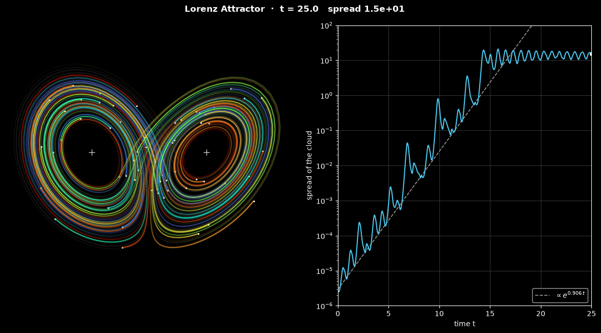

# Lorenz Attractor Simulation

This script integrates the Lorenz equations, a three-mode model of convection in a fluid layer heated from below, for 60 trajectories that start within $10^{-5}$ of one another and animates how they fan out over the butterfly-shaped attractor. The trajectories are advanced together with the classical fourth-order Runge-Kutta method, a slowly swinging 3D view shows their glowing trails, and a second panel plots their spread on a log scale, where it grows exponentially at the rate of the largest Lyapunov exponent until it reaches the size of the attractor.

## Overview

- **Model**: the Lorenz (1963) equations with the classic parameters $\sigma = 10$, $\rho = 28$ and $\beta = 8/3$ (`SIGMA`, `RHO`, `BETA`). They are a truncation of the Boussinesq equations of Rayleigh-Bénard convection to three Fourier modes; the [Rayleigh-Bénard convection script](../rayleigh_benard_convection/) solves the full 2D equations.
- **Ensemble**: 60 states (`N_TRAJECTORIES`) evenly spaced on a straight segment of length $10^{-5}$ (`INITIAL_LENGTH`) with a seeded random direction (`SEED = 0`). The segment is centred on the point reached from $(1, 1, 1)$ after a transient of 30 time units, so every state starts on the attractor.
- **Integration**: classical RK4 with $\Delta t = 0.01$; all trajectories are advanced as one $60 \times 3$ array.
- **3D view**: the last 1.2 time units (`TRAIL_STEPS = 120` steps) of every trajectory are drawn as a trail that fades with age, a wide faint line under a thin bright one, with a white dot at the current state. Colours follow the `turbo` map along the initial segment, so the stretched segment appears as a rainbow ribbon. A dim grey orbit of 60 time units outlines the attractor, white crosses mark the fixed points $C_\pm$, and the camera swings $\pm 35^\circ$ about the front view with a period of 12.5 time units.
- **Spread panel**: the RMS distance of the states from their centroid against time, on a log scale, with a dashed line $`\propto e^{0.906\,t}`$.
- **Run**: 500 frames of 5 RK4 steps ($t = 25$). The status line shows the time and the current spread.
- **Reel**: `--reel FILE` renders the run as a 1080 × 1920 MP4 for YouTube Shorts or Instagram Reels, with the 3D view above the spread panel.

## Mathematical Background

### From Convection to Three Equations

Saltzman (1962), "Finite amplitude free convection as an initial value problem—I", *Journal of the Atmospheric Sciences* 19, 329–341, expanded 2D Boussinesq convection between two free-slip, isothermal plates a distance $H$ apart in Fourier modes. Lorenz (1963), "Deterministic nonperiodic flow", *Journal of the Atmospheric Sciences* 20, 130–141, kept only three of them: one roll pattern of the streamfunction $\psi$ and two modes of the departure $\theta$ of the temperature from the linear conduction profile,

```math
\psi = C_\psi\,\sqrt{2}\,X(t)\sin\frac{\pi a x}{H}\sin\frac{\pi z}{H},
\qquad \theta = C_\theta\left[\sqrt{2}\,Y(t)\cos\frac{\pi a x}{H}\sin\frac{\pi z}{H} - Z(t)\sin\frac{2\pi z}{H}\right]
```

where $a$ is the ratio of the layer depth to half the roll wavelength, and $C_\psi$ and $C_\theta$ are scale factors. The three amplitudes have a physical meaning:

- $X$ is the intensity of the convective motion, and its sign the direction in which the rolls turn;
- $Y$ is the temperature difference between the rising and the sinking currents;
- $Z$ is the distortion of the vertical temperature profile from a straight line; positive $Z$ means the strongest gradients sit next to the plates.

Projecting the Boussinesq equations onto these modes (a Galerkin projection) and dropping all others gives, with $x, y, z$ for $X, Y, Z$,

$$
\frac{dx}{dt} = \sigma(y - x),
\qquad \frac{dy}{dt} = x(\rho - z) - y,
\qquad \frac{dz}{dt} = xy - \beta z
$$

Time is measured in units of $H^2/\left(\pi^2(1 + a^2)\kappa\right)$, and

$$
\sigma = \frac{\nu}{\kappa},
\qquad \rho = \frac{Ra}{Ra_c},
\qquad \beta = \frac{4}{1 + a^2}
$$

are the Prandtl number, the Rayleigh number over its critical value, and a geometric factor. Between free-slip plates $Ra_c = \pi^4(1 + a^2)^3/a^2$, which is smallest, $27\pi^4/4 \approx 657.5$, for $a^2 = 1/2$; this gives $\beta = 8/3$.

The truncation describes real convection only close to onset. At $\rho = 28$ the neglected modes are no longer small, so the chaos shown here is a property of the model rather than a prediction for a convection cell. Its importance is that a deterministic, dissipative model of a flow with only three variables already makes long-range prediction impossible.

### Fixed Points

The origin is pure conduction: no motion and a linear temperature profile. It is stable for $\rho < 1$. For $\rho > 1$ there are two more fixed points, steady rolls turning one way or the other:

$$
C_\pm = \left(\pm \sqrt{\beta(\rho - 1)},\ \pm \sqrt{\beta(\rho - 1)},\ \rho - 1\right)
$$

which are $(\pm 8.49, \pm 8.49, 27)$ here. They lose stability at $\rho_H = \sigma(\sigma + \beta + 3)/(\sigma - \beta - 1) \approx 24.74$, so at $\rho = 28$ all three fixed points are unstable. Trajectories circle one of $C_\pm$ with growing amplitude, then jump to the other wing, in an order that never repeats.

### Volume Contraction

The divergence of the vector field is the same everywhere:

$$
\nabla\cdot\mathbf{f} = \frac{\partial \dot x}{\partial x} +
\frac{\partial \dot y}{\partial y} +
\frac{\partial \dot z}{\partial z} = -(\sigma + 1 + \beta) = -\frac{41}{3}
$$

so every volume of initial states shrinks as $`V(t) = V(0)\,e^{-(\sigma + 1 + \beta)t}`$, by a factor of $10^{-6}$ per unit of time. The attractor has zero volume: the states collapse onto thin sheets, while they are stretched apart within the sheets.

### Sensitive Dependence on Initial Conditions

Two neighbouring states separate on average as $`|\delta(t)| \approx |\delta(0)|\,e^{\lambda_1 t}`$, with largest Lyapunov exponent $\lambda_1 \approx 0.906$ for these parameters. The spread of the ensemble is measured by

$$
s = \sqrt{\frac{1}{N}\sum_{i=1}^{N}|\mathbf{x}_i - \bar{\mathbf{x}}|^2}
$$

which starts at $s_0 = L\sqrt{(N + 1)/(12(N - 1))} = 2.9\times10^{-6}$ for $N = 60$ states on a segment of length $L = 10^{-5}$. Once the states cover the attractor, $s$ fluctuates around 14. Growth at the rate $\lambda_1$ would take $s$ from $s_0$ to this value in $t \approx \ln(14/s_0)/0.906 \approx 17$. The growth is not smooth: separations grow quickly on some parts of the attractor and shrink on others, which gives the wiggles of the spread curve. In this run the cloud fills the attractor a little earlier, at $t \approx 14$.

### Runge-Kutta Integration

Each step of `rk4_step` evaluates the right-hand side $\mathbf{f}$ four times:

```math
\mathbf{k}_1 = \mathbf{f}(\mathbf{x}_n),
\qquad
\mathbf{k}_2 = \mathbf{f}\left(\mathbf{x}_n + \tfrac{\Delta t}{2}\mathbf{k}_1\right),
\qquad
\mathbf{k}_3 = \mathbf{f}\left(\mathbf{x}_n + \tfrac{\Delta t}{2}\mathbf{k}_2\right),
\qquad \mathbf{k}_4 = \mathbf{f}(\mathbf{x}_n + \Delta t\,\mathbf{k}_3)
```

$$
\mathbf{x}_{n+1} = \mathbf{x}_n +
\frac{\Delta t}{6}\left(\mathbf{k}_1 + 2\mathbf{k}_2 + 2\mathbf{k}_3 +
\mathbf{k}_4\right)
$$

The global error is $O(\Delta t^4)$. The eigenvalues of the Jacobian of $\mathbf{f}$ have magnitude at most about 23 on and around the attractor (the stable eigenvalue of the origin is $-22.8$), so $|\lambda|\Delta t \le 0.23$ lies well inside the stability region of RK4, which reaches $2.79$ on the negative real axis. Because nearby trajectories separate exponentially, a computed trajectory follows the exact one from the same start only for a limited time. Statistical properties, such as the shape of the attractor and the average growth rate, are not affected by this.

## Implementation

- `lorenz_rhs(state, sigma, rho, beta)` evaluates $\mathbf{f}$ for states stored along the last axis, so one call handles the whole ensemble.
- `rk4_step(state, dt, rhs)` performs one classical Runge-Kutta step, and `integrate(state, duration, dt)` repeats it.
- `fixed_points` returns the origin and $C_\pm$, `divergence` the constant $-(\sigma + 1 + \beta)$, and `spread(points)` the RMS distance from the centroid.
- `initial_line(n, length, rng)` integrates the transient from `START` and places the `n` states on the segment.
- `LorenzSimulation(n_trajectories, initial_length, trail_steps, ghost_time, seed)` derives from the shared `Simulation` class in [`scripts/_animation.py`](../../_animation.py). It holds the current `points`, the `trail` of the last `trail_steps + 1` states (a `collections.deque`), the `times` and `spreads` recorded after every step, and the fixed reference orbit `ghost`. `step()` performs one RK4 step and records the trail and the spread.
- `LorenzView` draws the trails as two `Line3DCollection`s with per-segment colours and opacities, and the spread history on a logarithmic axis. The camera angle is a function of the simulation time, so `draw()` never advances the state. The window puts the two panels side by side, a reel stacks them. `duration` sets the time axis of the spread panel; `main` passes the length of the run.
- Parameters are module constants: `SIGMA`, `RHO`, `BETA`, `TIME_STEP`, `N_TRAJECTORIES`, `INITIAL_LENGTH`, `TRAIL_STEPS`, `STEPS_PER_FRAME`, `N_FRAMES`, and the camera settings `ELEVATION`, `AZIMUTH`, `SWING` and `SWING_PERIOD`.

## Usage

```bash
python main.py                                    # animate in a window (space pauses)
python main.py --no-show --output . --steps 500   # save the final frame as a PNG
python main.py --reel reel.mp4                    # 30 s vertical video for Shorts/Reels
```

`--steps N` sets the number of frames; each frame is 5 RK4 steps of $\Delta t = 0.01$.

## Output



The image shows the final frame of the default run ($t = 25$):

- **Attractor** (left): the 60 trajectories, which started $10^{-5}$ apart, are spread over both wings around $C_+$ and $C_-$ (white crosses). Their colours, ordered along the initial segment, are completely mixed.
- **Spread** (right): from $2.9\times10^{-6}$ the spread rises along the dashed line $`\propto e^{0.906\,t}`$, with wiggles of up to about a decade, and reaches the size of the attractor at $t \approx 14$. After $t \approx 17$ it fluctuates between about 8 and 19.

The reel shows the whole story: for the first 40% the states travel as a single comet around the wings; near $t = 13$ the comet fans out into a rainbow ribbon that is stretched and folded over both wings, and in the last third the trails cover the attractor.

## Related Notes

- [Energy equation and the Boussinesq approximation](../../../notes/fluid_mechanics/governing_equations/energy.md)
- [Dimensionless numbers, including the Rayleigh number](../../../notes/fluid_mechanics/dimensions.md)
- [POD-Galerkin projection](../../../notes/numerical/rom/pod_galerkin_projection.md)
- [Turbulence and sensitive dependence on initial conditions](../../../notes/fluid_mechanics/turbulence/README.md)
