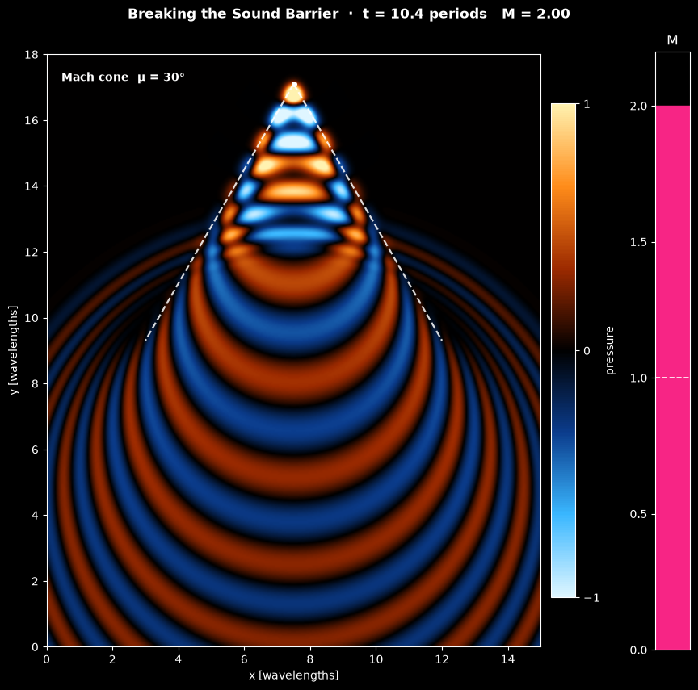

# Mach Cone of a Moving Sound Source

This script simulates the sound of a small source that accelerates from rest to twice the speed of sound and animates its pressure field, from the Doppler-compressed wavefronts of a subsonic source through the pile-up at Mach 1 to the Mach cone of a supersonic one. The 2D wave equation for the acoustic pressure is solved with second-order finite differences in space and time, an absorbing sponge layer keeps reflections out of the picture, and the theoretical Mach lines of half-angle $\mu = \arcsin(1/M)$ are drawn over the field once the source is supersonic.

## Overview

- **Units**: lengths are in wavelengths $\lambda$ of the tone at rest and times in its periods, so the speed of sound is $c = 1$.
- **Medium**: a still 2D acoustic medium, 15 × 18 wavelengths visible, surrounded by a sponge layer 3.5 wavelengths thick on every side.
- **Source**: a Gaussian with standard deviation $r = 0.15$ (`SOURCE_RADIUS`) whose strength oscillates at frequency 1 with an amplitude that ramps up smoothly over the first period. It starts at rest 3.5 wavelengths above the bottom of the visible domain and moves up the centre line.
- **Motion**: the Mach number rises linearly from 0 to 2 over 7.2 periods and then stays at 2, so the source passes Mach 1 at $t = 3.6$ and ends 17.1 wavelengths up at $t = 10.4$.
- **Scheme**: leapfrog in time with the five-point Laplacian on a grid of 25 points per wavelength (552 × 627 nodes with the sponge), Courant number $`c\,\Delta t/h = 0.3125`$ and $\Delta t = 1/80$ period. The outermost nodes hold $p = 0$.
- **Animation**: 208 frames of 4 time steps reach $t = 10.4$. The signed pressure is shown with a diverging colour map with a black centre on a fixed scale from $-1$ to $1$, which the pile-up and the cone saturate. A gauge next to the field shows the Mach number (blue below 1, pink above), the dashed white lines are the theoretical Mach cone, and a label names the regime. The status line shows the time and the Mach number.
- **Speed**: a full run of 832 time steps takes about 7 seconds with NumPy.
- **Reel**: `--reel FILE` renders the run as a 1080 × 1920 MP4 for YouTube Shorts or Instagram Reels.

## Mathematical Background

### Forced, Damped Wave Equation

Small pressure disturbances $p$ in a still medium obey the wave equation. The script adds a source term $f$ and a damping term that is nonzero only in the sponge layer:

$$
\frac{\partial^2 p}{\partial t^2} + \sigma(\mathbf{x})
\frac{\partial p}{\partial t} = c^2 \nabla^2 p + f(\mathbf{x}, t),
\qquad f = s(t) \exp\left(-\frac{|\mathbf{x} - \mathbf{x}_s(t)|^2}{2r^2}\right)
$$

The source signal is a tone of frequency $f_0 = 1$ that is switched on smoothly,

$$
s(t) = A\left(1 - e^{-(t/\tau)^2}\right)\sin(2\pi f_0 t),
\qquad \tau = 1
$$

A sine switched on abruptly would have a time integral with a nonzero mean, and in 2D that leaves a slowly decaying pressure offset behind the wavefronts.

### Motion of the Source

With $T_a = 7.2$ and $M_{max} = 2$, the source moves along $x = 7.5$ with

```math
M(t) = M_{max}\min\left(\frac{t}{T_a}, 1\right),
\qquad y_s(t) = y_0 + c\int_0^t M(t')\, dt'
```

### Doppler Effect and Mach Cone

A wavefront emitted at time $t_e$ is a circle of radius $`c\,(t - t_e)`$ around the point where the source was at $t_e$. For a subsonic source the circles are nested: ahead of a source moving at constant $M$ the wavelength shrinks to $\lambda(1 - M)$ and behind it grows to $\lambda(1 + M)$. At $M = 1$ the source keeps up with its own wavefronts, which pile up in front of it. For $M > 1$ the source outruns them, and the circles have an envelope, the Mach cone, with apex at the source and half-angle

$$
\sin\mu = \frac{1}{M}
$$

which is $30^\circ$ at $M = 2$. No sound reaches the region ahead of the cone. Inside it each point receives two wavefronts, emitted at two different times, and their interference gives the chequered pattern near the apex. For an accelerating source the cone is curved: near the apex its angle follows the current Mach number, which is what the dashed lines show.

For a source of constant strength $`q = \int f\, dA`$ moving at constant $M > 1$, the steady pattern in 2D is exact and simple: the pressure is uniform inside the wedge and zero outside,

$$
p = \frac{q}{2c^2\sqrt{M^2 - 1}} \quad \text{for } |x - x_s| < (y_s - y)\tan\mu
$$

because in the frame of the source the wave equation becomes a 1D wave equation along the path, whose "time" is the distance behind the source. The tests use this to check the scheme.

### Leapfrog Scheme

With grid spacing $h$ and the five-point Laplacian $L$, central differences in time give

$$
p^{n+1}_{i,j} = \frac{2p^n_{i,j} - \left(1 - \tfrac12\sigma_{i,j}\Delta t\right)p^{n-1}_{i,j} + \Delta t^2\left(c^2 (L p^n)_{i,j} + f^n_{i,j}\right)}{1 + \tfrac12\sigma_{i,j}\Delta t}
$$

$$
(L p)_{i,j} = \frac{p_{i+1,j} + p_{i-1,j} + p_{i,j+1} + p_{i,j-1} - 4p_{i,j}}{h^2}
$$

The scheme is second order in space and time and stable for $`c\,\Delta t/h \le 1/\sqrt{2}`$. At 25 points per wavelength the tone travels 0.24% too slowly along the grid axes and 0.10% too slowly along the diagonals.

### Discrete Energy

Without source and damping the leapfrog scheme conserves, to round-off, the discrete energy

$$
E^{n-1/2} = \frac{h^2}{2}\sum_{i,j}\left(\frac{p^n_{i,j} - p^{n-1}_{i,j}}{\Delta t}\right)^2 + \frac{c^2}{2}\sum_{\text{edges}}\left(p^n_a - p^n_b\right)\left(p^{n-1}_a - p^{n-1}_b\right)
$$

where the second sum runs over all pairs $(a, b)$ of neighbouring nodes. It is positive under the stability condition, which is why the scheme cannot blow up.

### Sponge Layer

In the sponge the damping rate rises quadratically from 0 at its inner edge to $\sigma_{max} = 8$ per period at the outer edge, over $W = 3.5$ wavelengths. Where $\sigma \ll \omega$ a wave decays as $`\exp\left(-\int \sigma\,dx/(2c)\right)`$; applied across the layer and back, this rough estimate damps a wave reflected at the outer edge by $\exp(-\sigma_{max} W/(3c)) \approx 10^{-4}$. The smooth profile keeps the reflection from the inner edge small as well. In the tests a pulse leaves about $10^{-4}$ of its energy in the domain after 20 periods.

## Implementation

- `mach_number(t)` and `travelled(t)` give the Mach number and the distance covered by the source; `sponge_profile` builds the damping rate along one axis, and `laplacian` the five-point Laplacian.
- `MachConeSimulation(width, height, cells_per_wavelength, sponge_width, mach_max, acceleration_time, source_start, amplitude)` derives from the shared `Simulation` class in [`scripts/_animation.py`](../../_animation.py). It holds the pressure `p` and `p_previous` at two time levels; `step()` adds the source (`add_forcing`, evaluated on a patch of five source radii) and applies the leapfrog update. `source_signal(t)` is the tone with its ramp, `source_position()` the position of the source, `mach` its Mach number, and `energy()` the discrete energy above. `acceleration_time=0` gives a source moving at constant `mach_max` from the start.
- `MachConeView` shows the visible part of `p` with `imshow`, the source as a white dot, the two Mach lines of length `CONE_LENGTH`, the regime label and the Mach gauge. Nothing is recreated between frames.
- Parameters are module constants: `WIDTH`, `HEIGHT`, `SPONGE_WIDTH`, `SPONGE_DAMPING`, `SOURCE_RADIUS`, `SOURCE_AMPLITUDE`, `MACH_MAX`, `ACCELERATION_TIME`, `END_TIME`, `CELLS_PER_WAVELENGTH`, `COURANT` and `PRESSURE_LIMIT`.

The numerical tests in `tests/test_new_mach_cone_moving_source.py` check that a stationary impulsive source gives a circular front growing at $c$ (to 0.5%), that the discrete energy is conserved to $10^{-12}$ without source and sponge, that the sponge absorbs an outgoing pulse, that a steady supersonic source gives the wedge above with the right angle (within $0.4^\circ$ for $M = 1.5$, 2 and 3) and pressure (within 0.5%), and that the cone of the oscillating source at $M = 2$, measured from arrival times, has a half-angle within $1^\circ$ of $30^\circ$.

## Usage

```bash
python main.py                                    # animate in a window (space pauses)
python main.py --no-show --output . --steps 208   # save the final frame as a PNG
python main.py --reel reel.mp4                    # 30 s vertical video for Shorts/Reels
```

`--steps N` sets the number of frames; each frame is 4 time steps of $1/80$ period, and the default 208 frames reach $t = 10.4$ periods.

## Output



The image shows the pressure at $t = 10.4$, when the source has flown at Mach 2 for 3.2 periods:

- **Mach cone**: the source (white dot) is near the top, and the region ahead of and beside it is silent. Behind it the waves fill a cone whose edges follow the dashed theoretical lines of half-angle $30^\circ$.
- **Inside the cone**: near the apex the waves from two emission times interfere into a chequered pattern of compressions (orange) and rarefactions (blue). Further back the straight edges bend into the curved envelope left while the source was still accelerating.
- **Lower half**: the nearly circular wavefronts emitted while the source was subsonic, still expanding at the speed of sound long after the source has left them behind.

The reel starts with a quiet source that begins to sing: concentric rings spread from it, then bunch up ahead and stretch out behind as it speeds up. At $M = 1$ the fronts pile up into a bright spot in front of the source, the gauge passes the dashed line and turns pink, and the Mach lines appear. As the source accelerates to Mach 2 the cone narrows from wide open to $30^\circ$ and sweeps up the frame, leaving the older rings behind.

## Related Notes

- [Speed of sound and Mach number](../../../notes/fluid_mechanics/compressible_flow/speed_of_sound.md)
- [Shock waves and expansion fans](../../../notes/fluid_mechanics/compressible_flow/shock_waves.md)
- [Finite difference discretization](../../../notes/numerical/fdm/discretization.md)
- [Numerical stability](../../../notes/numerical/cfd/numerical_stability.md)
