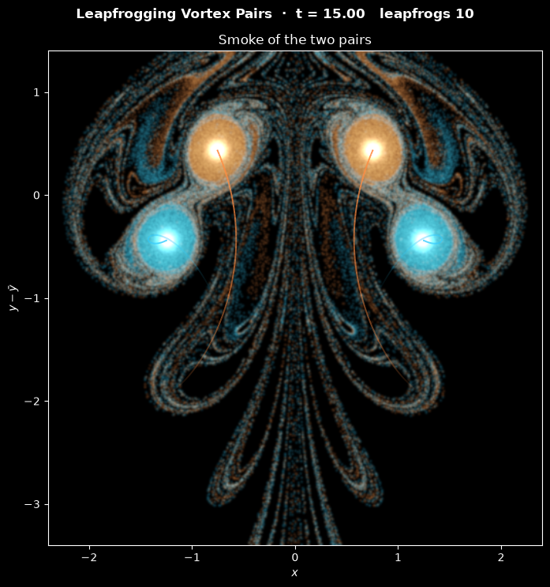

# Leapfrogging Vortex Pairs

This script simulates two coaxial vortex pairs, four point vortices in all, that leapfrog: the rear pair contracts, speeds up and slips through the front pair, which widens and slows down, and then the two swap roles again and again. It is the two-dimensional analogue of two smoke rings fired one after the other. The vortices are integrated with the fourth-order Runge-Kutta method, and 240 000 passive smoke tracers seeded around them are carried by the same velocity field, so the animation looks like glowing smoke following the pairs.

## Overview

- **Vortices**: two identical pairs of half-width $b = 1$, each with a counter-clockwise vortex ($+\Gamma$) on the left and a clockwise vortex ($-\Gamma$) on the right, so both travel in $+y$. The circulation is $\Gamma = 2\pi$, which makes $\Gamma/2\pi = 1$; lengths are in units of $b$.
- **Initial gap**: the front pair starts a distance $`L = 1.078\,b`$ ahead of the rear pair. The gap is computed from the conservation laws so that the pairs pass each other with half-widths in the ratio $\alpha = 0.4$ (`ALPHA`), inside the range $\alpha > 0.382$ where leapfrogging is stable. One vortex is shifted sideways by $10^{-3}$ to break the mirror symmetry, so an unstable configuration shows its instability.
- **Smoothing**: every vortex has a Krasny core of radius $\delta = 0.15$, which keeps the velocity finite near the centres. It changes the interaction of the vortices by at most about 3 %.
- **Smoke**: 60 000 tracers in a Gaussian blob of standard deviation 0.25 around each vortex, cyan for the pair that starts at the rear and orange for the pair that starts in front.
- **Integration**: RK4 with $\Delta t = 0.0025$ for the vortices and tracers together, compiled with Numba and run in parallel over the tracers. A frame is 20 steps, and the default 300 frames ($t = 15$) contain ten leapfrogs.
- **Display**: the smoke density of each pair is counted on a 480 × 480 pixel grid, blurred by 0.8 pixel and tone mapped to cyan and orange, with a white glow at each vortex and fading trails of the vortex paths. The view follows the centroid of the four vortices, so the vertical axis is $y - \bar{y}$.
- **Reel**: `--reel FILE` renders the run as a 1080 × 1920 MP4 for YouTube Shorts or Instagram Reels.

## Mathematical Background

### Point-Vortex Equations

$N$ point vortices with circulations $\Gamma_j$ at $(x_j, y_j)$ move with the velocity that all the others induce. With the Krasny smoothing length $\delta$,

$$
\frac{dx_k}{dt} = -\frac{1}{2\pi} \sum_{j \ne k}
\frac{\Gamma_j (y_k - y_j)}{r_{kj}^2 + \delta^2},
\qquad \frac{dy_k}{dt} = \frac{1}{2\pi} \sum_{j \ne k}
\frac{\Gamma_j (x_k - x_j)}{r_{kj}^2 + \delta^2},
\qquad r_{kj}^2 = (x_k - x_j)^2 + (y_k - y_j)^2
$$

$\delta = 0$ gives the exact point vortices of an inviscid fluid. Krasny (1986, *Desingularization of periodic vortex sheet roll-up*, J. Comput. Phys. 65, 292–313) used this smoothing to compute the roll-up of vortex sheets; here it acts like a finite vortex core. A smoke tracer at $(x, y)$ moves with the same sum taken over all four vortices. A vortex induces no velocity at its own centre, so a tracer placed on a vortex stays on it.

### Single Pair

Two vortices $\pm\Gamma$ a distance $d$ apart move together perpendicular to the line joining them, at the speed

$$
V = \frac{\Gamma}{2\pi d} \quad (\delta = 0),
\qquad V = \frac{\Gamma d}{2\pi (d^2 + \delta^2)} \quad (\delta > 0)
$$

A narrow pair is fast and a wide pair is slow. This is the whole mechanism of leapfrogging: the front pair pushes the rear pair's vortices towards the axis, so the rear pair narrows and speeds up, while the rear pair pushes the front pair's vortices apart, so the front pair widens and slows down.

### Invariants

The motion is Hamiltonian with $`\Gamma_k\, dx_k/dt = \partial H/\partial y_k`$ and $`\Gamma_k\, dy_k/dt = -\partial H/\partial x_k`$, where

$$
H = -\frac{1}{4\pi} \sum_{j < k} \Gamma_j \Gamma_k \ln\left(r_{jk}^2 + \delta^2\right)
$$

is the interaction energy. Because the interaction depends only on the distances, the linear impulse and the angular impulse

$$
\mathbf{P} = \left(\sum_k \Gamma_k y_k,\ - \sum_k \Gamma_k x_k\right),
\qquad I = \sum_k \Gamma_k \left(x_k^2 + y_k^2\right)
$$

are conserved as well. The script prints the relative change of $H$ and the change of $\mathbf{P}$ at the end of a run; RK4 does not conserve them exactly, but over ten leapfrogs the drift of $H$ is about $10^{-12}$.

### Initial Gap and Love's Ratio

In a mirror-symmetric motion the left vortices sit at $x = -p_1$ and $x = -p_2$ and the right ones at $x = p_1$ and $x = p_2$, so $P_y = 2\Gamma (p_1 + p_2)$ and the sum of the two half-widths is constant. When the pairs pass side by side, with half-widths $\alpha A$ and $A$, conservation of $P_y$ from the start (two half-widths $b$) gives $A (1 + \alpha) = 2b$. Conservation of $H$ (with $\delta = 0$) between the start, two pairs a distance $L$ apart, and the passing configuration gives

$$
\frac{L^2}{4b^2 + L^2} = \frac{(1 - \alpha)^2}{4\alpha} \quad\Longrightarrow\quad
L = \frac{2b (1 - \alpha)}{\sqrt{6\alpha - \alpha^2 - 1}}
$$

which is what `pair_separation` returns. A solution exists only for $(1 - \alpha)^2 < 4\alpha$, that is $\alpha > 3 - 2\sqrt{2} \approx 0.172$: Love (1894, *On the motion of paired vortices with a common axis*, Proc. London Math. Soc. 25, 185–194) showed that below this ratio the inner pair escapes and the pairs never leapfrog. As $\alpha \to 0.172$ the starting gap grows without bound.

### Stability

Periodic leapfrogging is not always stable. Acheson (2000, *Instability of vortex leapfrogging*, Eur. J. Phys. 21, 269–273) found numerically that small asymmetric disturbances grow when $0.172 < \alpha < 0.382$, and Tophøj and Aref (2013, *Instability of vortex pair leapfrogging*, Phys. Fluids 25, 014107) showed with a Floquet analysis that the transition lies at $\alpha = \varphi^{-2} = (3 - \sqrt{5})/2 \approx 0.382$, with $\varphi$ the golden ratio. The default $\alpha = 0.4$ is just on the stable side: the $10^{-3}$ asymmetry stays at that size (checked over 100 time units, about 65 leapfrogs). With `--alpha 0.3` it grows, and after about four passages the pairs stop leapfrogging and the vortices scatter.

### Time Integration

The vortex positions $\mathbf{z}$ and the tracer positions $\mathbf{p}$ form one system, integrated with RK4. Each stage first evaluates the vortex velocities $\mathbf{k}_i$ and then evaluates the tracer velocities at the vortex positions of the same stage:

```math
\mathbf{z}^{(1)} = \mathbf{z}_n,
\qquad \mathbf{z}^{(2)} = \mathbf{z}_n + \tfrac{\Delta t}{2}\mathbf{k}_1,
\qquad \mathbf{z}^{(3)} = \mathbf{z}_n + \tfrac{\Delta t}{2}\mathbf{k}_2,
\qquad \mathbf{z}^{(4)} = \mathbf{z}_n + \Delta t\, \mathbf{k}_3,
\qquad \mathbf{z}_{n+1} = \mathbf{z}_n +
\frac{\Delta t}{6}\left(\mathbf{k}_1 + 2\mathbf{k}_2 + 2\mathbf{k}_3 +
\mathbf{k}_4\right)
```

The error is $O(\Delta t^4)$. Near a vortex centre a tracer turns at up to $\Gamma/(2\pi\delta^2) \approx 44$ radians per unit time, and $\Delta t = 0.0025$ resolves that with about 0.1 radian per step.

## Implementation

- `pair_separation(alpha, half_width)` returns $L$ and `initial_vortices(alpha, half_width, perturbation)` the starting positions and circulations (vortices 0 and 1 form the rear pair, 2 and 3 the front pair).
- `induced_velocity` and `vortex_velocities` evaluate the smoothed sums with Numba. `rk4_step(x, y, px, py, circulation, core, dt)` advances the vortices and tracers in place, in parallel over the tracers.
- `hamiltonian`, `linear_impulse` and `angular_impulse` compute the invariants; `half_widths` returns the half-width of each pair.
- `LeapfrogSimulation(alpha, smoke_per_vortex, core, dt, seed)` derives from the shared `Simulation` class in [`scripts/_animation.py`](../../_animation.py). `step()` is one `rk4_step`; it appends the vortex positions to `history` and increments `leapfrogs` whenever the order of the two pair centres along $y$ swaps.
- `LeapfrogView` rasterises the smoke near the current centroid with `count_smoke`, tone maps it and draws it with `imshow`. The trails are a `LineCollection` built from the last 1.5 time units of `history`, faded from transparent to opaque.
- Parameters are module constants: `CIRCULATION`, `HALF_WIDTH`, `ALPHA`, `CORE_RADIUS`, `PERTURBATION`, `SMOKE_PER_VORTEX`, `SMOKE_RADIUS`, `TIME_STEP`, `STEPS_PER_FRAME`, `N_FRAMES`, `VIEW_X`, `VIEW_Y`, `IMAGE_SIZE`, `SMOKE_GAIN`, `SMOKE_GAMMA` and `TRAIL_TIME`.

## Usage

```bash
python main.py                                    # animate in a window (space pauses)
python main.py --alpha 0.3 --steps 600            # unstable regime: the pairs break up
python main.py --no-show --output . --steps 300   # save the final frame as a PNG
python main.py --reel reel.mp4                    # 30 s vertical video for Shorts/Reels
```

`--steps N` sets the number of frames; each frame is 20 RK4 steps of $\Delta t = 0.0025$. `--alpha A` sets the half-width ratio at which the pairs pass, between 0.172 and 1; leapfrogging is stable above 0.382.

## Output



The image shows the default run at $t = 15$, after ten leapfrogs:

- **Vortices**: the orange pair (which started in front) has just passed through the cyan pair for the fifth time. It is still narrow, with its vortices at $x \approx \pm 0.75$, while the cyan pair behind it is wide, at $x \approx \pm 1.25$. The half-widths oscillate between $\alpha A = 0.57$ and $A = 1.43$, and the pairs travel at about one unit per unit time, passing each other every 1.54 time units.
- **Smoke**: each core keeps a dense blob of its own smoke, wrapped in thin layers of both colours. The fluid that moves with the four vortices forms a mushroom-shaped cap, and smoke stripped from it trails behind in a wake of long filaments.
- **Trails**: the faded lines show where the vortices were during the last 1.5 time units. The narrow pair has covered a long, curved path, and the wide pair only a short one.

The reel starts with four round blobs of smoke. The rear (cyan) pair immediately contracts and shoots through the orange pair, the smoke rolls up into a mushroom-shaped cap within the first few leapfrogs, and the following leapfrogs pull a growing wake of filaments out behind it.

## Related Notes

- [Potential flow: the point vortex](../../../notes/fluid_mechanics/inviscid_flow/potential_flow.md)
- [Flow kinematics: vorticity and pathlines](../../../notes/fluid_mechanics/flow_kinematics/flow_kinematics.md)
- [Eulerian and Lagrangian descriptions of flow](../../../notes/fluid_mechanics/flow_kinematics/eulerian_lagrangian_flows.md)
