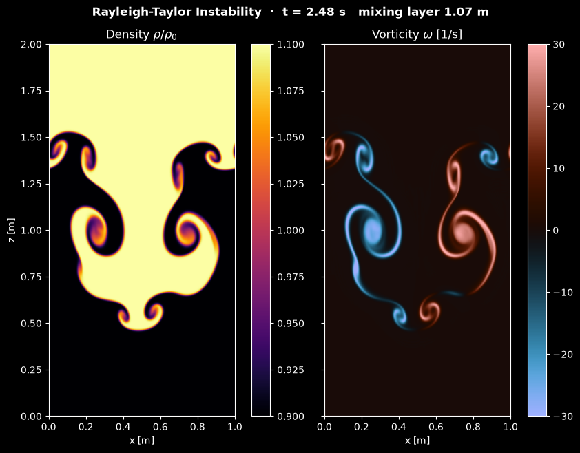

# Rayleigh-Taylor Instability

This script simulates the Rayleigh-Taylor instability of heavy fluid resting on light fluid in a tall 2D box and animates how a rippled interface grows into rising bubbles and falling mushroom-shaped spikes. It solves the Boussinesq equations in vorticity-streamfunction form with fifth-order WENO advection, an exact FFT/sine-transform Poisson solver and a third-order strong-stability-preserving Runge-Kutta scheme. The early growth of the ripple is checked against linear theory in the tests.

## Overview

- **Domain**: a box 1 m wide (periodic in $x$) and 2 m high between two impermeable free-slip walls, on 256 × 512 cells of 3.9 mm.
- **Fluids**: heavy fluid ($`\rho = 1.1\,\rho_0`$) above light fluid ($`\rho = 0.9\,\rho_0`$), Atwood number $A = 0.1$, $g = 9.81$ m/s², kinematic viscosity $\nu = 2 \times 10^{-4}$ m²/s and mass diffusivity $\kappa = 2 \times 10^{-5}$ m²/s.
- **Initial state**: fluid at rest with a smooth $\tanh$ interface of half-thickness $\delta = 1.5$ cm at mid-height, displaced by a single cosine mode of amplitude 1 cm and wavelength 1 m, plus seeded random modes 2 to 32 with an rms height of 10 µm that break the left-right symmetry.
- **Solver**: flux-form WENO5 advection of density and vorticity on a staggered grid whose face velocities are exactly divergence-free, an exact Poisson solve for the streamfunction, explicit viscosity and diffusion, and SSP-RK3 time steps limited by a CFL number of 0.6.
- **Display**: density $\rho/\rho_0$ (`inferno`, fixed range 0.9 to 1.1) next to vorticity (`berlin`, fixed range ±30 1/s). The status line gives the time and the height of the mixing layer. Each frame is 4 time steps, and the default 835 frames reach $t \approx 4.4$ s.
- **Reel**: `--reel FILE` renders the run as a 1080 × 1920 MP4 for YouTube Shorts or Instagram Reels, with the two tall panels side by side.

## Mathematical Background

### Boussinesq Equations in Vorticity-Streamfunction Form

The density differs from a reference $\rho_0$ by at most 10 %, and the Boussinesq approximation keeps the difference only where it multiplies gravity. With the streamfunction $\psi$, the velocity $(u, w)$ in the $(x, z)$ plane and the vorticity $\omega$ are

$$
u = \frac{\partial \psi}{\partial z},
\qquad w = -\frac{\partial \psi}{\partial x},
\qquad \omega = \frac{\partial w}{\partial x} -
\frac{\partial u}{\partial z} = -\nabla^2\psi
$$

and the flow obeys

```math
\frac{\partial \omega}{\partial t} + \nabla\cdot(\mathbf{u}\,\omega) = -\frac{g}{\rho_0}
\frac{\partial \rho}{\partial x} + \nu\nabla^2\omega,
\qquad \frac{\partial \rho}{\partial t} +
\nabla\cdot(\mathbf{u}\,\rho) = \kappa\nabla^2\rho
```

The baroclinic term $`-(g/\rho_0)\,\partial\rho/\partial x`$ creates vorticity wherever the interface is tilted. Because $\nabla\cdot\mathbf{u} = 0$, the advection terms can be written in conservative (flux) form.

### Boundary Conditions

The walls at $z = 0$ and $z = H$ are impermeable and free-slip: $w = 0$ and $\partial u/\partial z = 0$, which gives $\psi = 0$ and $\omega = 0$ there. The density has no flux through the walls. Free-slip walls fit this problem for three reasons:

- the seeded mode decays away from the interface as $e^{-k|z|}$, and $e^{-2\pi} \approx 0.002$ at the walls, so the walls do not affect the growth;
- no-slip walls would need boundary layers that 512 cells cannot resolve once the plumes hit the walls;
- $\psi = \omega = 0$ makes both fields sine series in $z$, which is exactly what the sine-transform Poisson solver needs.

### Linear Theory

For a sharp interface, a ripple $\eta = a\cos(kx)$ grows as $e^{\sigma t}$ with $\sigma = \sqrt{Agk}$ (Rayleigh, 1883; Taylor, 1950). For the $\tanh$ profile $\rho = \rho_0\left[1 + A\tanh(z/\delta)\right]$ used here, with $z$ measured from the interface, the linearised Boussinesq equations for $`w = \hat w(z)\,e^{ikx + \sigma t}`$ become

```math
\frac{d^2\hat w}{dz^2} - k^2\hat w +
\frac{gAk^2}{\sigma^2\delta}\,\mathrm{sech}^2\!\left(\frac{z}{\delta}\right)\hat w = 0
```

This has the form of the Pöschl-Teller problem of quantum mechanics. Its bounded solution is $\hat w = \mathrm{sech}^{k\delta}(z/\delta)$, so

$$
\sigma = \sqrt{\frac{A g k}{1 + k\delta}}
$$

A finite interface thickness slows the growth, and very short waves grow at most at the buoyancy frequency $\sqrt{Ag/\delta}$. For the seeded mode, $k = 2\pi$ m⁻¹ and $k\delta = 0.094$, so $\sigma = 2.37$ s⁻¹ (the sharp-interface value is 2.48 s⁻¹). Viscosity and diffusion damp a mode at rates of order $\nu k^2$ and $\kappa k^2$, which is below 0.01 s⁻¹ (0.3 % of $\sigma$) here. They cut off only waves shorter than about 4 cm, where $\nu k^2$ exceeds the growth rate.

In the Boussinesq model, bubbles and spikes are mirror images of each other, apart from the noise. At large Atwood numbers real spikes fall faster than bubbles rise; this asymmetry is of order $A$ and is left out.

### Discretisation

The density $\rho_{i,j}$ lives at cell centres; $\psi$ and $\omega$ live at the cell corners (nodes), including the wall rows.

1. **Poisson equation**: $\nabla_h^2\psi = -\omega$ with the 5-point Laplacian is solved exactly by a real FFT in $x$ and a type-I discrete sine transform in $z$, using the eigenvalues

   ```math
   \lambda_{m,n} = -\left(\frac{2\sin(\pi m/N_x)}{\Delta x}\right)^2 - \left(\frac{2\sin(\pi n/(2N_z))}{\Delta z}\right)^2
   ```

2. **Face velocities**: every velocity is a difference of $\psi$ across a face, $u = (\psi_{\mathrm{top}} - \psi_{\mathrm{bottom}})/\Delta z$ on vertical faces and $w = -(\psi_{\mathrm{right}} - \psi_{\mathrm{left}})/\Delta x$ on horizontal ones. The net volume flux out of every cell is then exactly zero, so a uniform density stays uniform. The vorticity uses the cells around the nodes, with $\psi$ averaged to the cell centres.

3. **Advection** (WENO5, Jiang & Shu, 1996): the value at each face is reconstructed from five upwind-biased cell values as a weighted mix of three third-order candidates. The weights favour smooth stencils, so the scheme is fifth-order in smooth regions and does not create the wiggles that central differences produce at sharp fronts. First-order upwinding would smear the thin mushroom caps. The flux is the face velocity times this value, which makes the scheme conservative: the mean density changes only by round-off. Ghost cells mirror the density at the walls and continue the vorticity as an odd function, consistent with $\omega = 0$.

4. **Source terms**: the baroclinic torque at a node uses the four surrounding cells, and viscosity and diffusion use 5-point Laplacians.

5. **Time stepping** (SSP-RK3, Shu & Osher, 1988), with $L$ the right-hand side:

   ```math
   q^{(1)} = q^n + \Delta t\,L(q^n),
   \quad q^{(2)} = \tfrac34 q^n + \tfrac14\left[q^{(1)} + \Delta t\,L(q^{(1)})\right],
   \quad q^{n+1} = \tfrac13 q^n + \tfrac23\left[q^{(2)} + \Delta t\,L(q^{(2)})\right]
   ```

   The Poisson equation is solved after every stage. The step is $\Delta t = \min\left(5\ \mathrm{ms},\ 0.6/(\max|u|/\Delta x + \max|w|/\Delta z)\right)$, so the slow linear phase takes large steps and the fast mixing phase small ones.

## Implementation

- `initial_fields` builds the perturbed $\tanh$ density profile and the zero vorticity. A negative `atwood` puts the light fluid on top.
- `poisson_eigenvalues` and `solve_streamfunction` implement the exact Poisson solve with `scipy.fft`.
- `weno5`, `advection_tendency` and `tendencies` are Numba kernels (`parallel=True`). `tendencies` fills the ghost cells, computes the face velocities from $\psi$ and returns $\partial\rho/\partial t$ and $\partial\omega/\partial t$.
- `RayleighTaylorSimulation(nx, nz, seed, atwood, gravity, viscosity, diffusivity, amplitude, mode, noise, max_time_step)` derives from the shared `Simulation` class in [`scripts/_animation.py`](../../_animation.py) and holds `density`, `vorticity`, `psi` and the elapsed time. `step()` is one SSP-RK3 step with the adaptive `time_step()`. `mixing_width()` returns the height of the layer whose horizontally averaged heavy-fluid fraction lies between 1 % and 99 %, and `mode_velocity()` the amplitude of the seeded mode in $w$ at mid-height.
- `RayleighTaylorView` draws the density and vorticity side by side with `imshow`, and updates the images without advancing the solver. In a reel the colour bars sit below the panels.
- Parameters are module constants: `WIDTH`, `HEIGHT`, `GRAVITY`, `ATWOOD`, `VISCOSITY`, `DIFFUSIVITY`, `INTERFACE_THICKNESS`, `PERTURBATION_AMPLITUDE`, `PERTURBATION_MODE`, `NOISE_AMPLITUDE`, `NX`, `NZ`, `CFL`, `MAX_TIME_STEP`, `STEPS_PER_FRAME` and `N_FRAMES`.

Unit tests check the solver:

- the growth rate of the seeded mode between $t = 1.5$ and $2.5$ s on a 64 × 128 grid matches $\sqrt{Agk/(1 + k\delta)}$ to 0.4 %; it converges to 0.1 % on 128 × 256 cells;
- the mean density is conserved to round-off, and the density leaves its initial range by less than 1 % of the density jump;
- light fluid over heavy fluid only oscillates as an internal gravity wave;
- a flat interface, or a rippled one without gravity, stays exactly at rest;
- the Poisson solve inverts the 5-point Laplacian, and a uniform density is not changed by any flow.

## Usage

```bash
python main.py                                    # animate in a window (space pauses)
python main.py --no-show --output . --steps 225   # save the frame at t = 2.5 s as a PNG
python main.py --reel reel.mp4                    # 30 s vertical video for Shorts/Reels
```

`--steps N` sets the number of frames; each frame is 4 time steps of at most 5 ms. A time step takes about 20 ms on a desktop CPU, so the default 3340 steps take a little over a minute, and a 30 s reel renders in about 2.5 minutes.

## Output



The image shows the flow after 225 frames ($t = 2.48$ s):

- **Density** (left): a spike of heavy fluid (yellow) falls through the middle of the box, and light fluid (black) rises as a bubble across the periodic side edges. Both have rolled up into mushroom caps, the spike's near $z = 0.5$ m and the bubble's near $z = 1.45$ m, and the shear along the sides of the spike has wound up two larger Kelvin-Helmholtz spirals at mid-height. Thin purple and orange layers mark fluid mixed by diffusion.
- **Vorticity** (right): the baroclinic torque creates vorticity of opposite sign on the two sides of the spike, clockwise (blue) on the left and counter-clockwise (red) on the right. These vortex sheets roll up into the cores of the spirals.

The reel starts from the flat interface, shows the ripple growing into the bubble and the spike, and follows the spike as it hits the bottom wall and the bubble as it reaches the top. The secondary roll-ups then break the flow into a turbulent mixing layer that fills the whole box by $t \approx 4$ s.

## Related Notes

- [Navier-Stokes equations](../../../notes/fluid_mechanics/governing_equations/navier_stokes.md)
- [Energy equation and the Boussinesq approximation](../../../notes/fluid_mechanics/governing_equations/energy.md)
- [Finite-volume discretization](../../../notes/numerical/fvm/discretization.md)
- [Numerical stability](../../../notes/numerical/cfd/numerical_stability.md)
