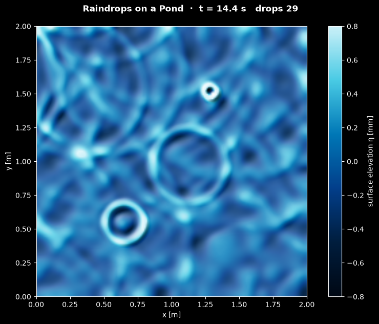

# Raindrops on a Pond: Shallow-Water Ripples

This script simulates raindrops falling on a square basin of still water by solving the 2D shallow-water equations with a conservative finite-volume scheme, and animates the free surface as shaded relief. Each drop adds a small Gaussian mound of water at a seeded random place and time; the mound collapses into a ring wave that spreads at $\sqrt{gH}$, reflects from the walls and interferes with the rings of earlier drops, while the rain grows heavier.

## Overview

- **Basin**: a square of side $L = 2$ m with still water of depth $H = 2$ cm, a flat bottom and four reflective (solid) walls. Long surface waves travel at $c = \sqrt{gH} = 0.44$ m/s, so a ring needs about 4.5 s to cross the basin.
- **Rain**: 37 drops over 16.8 s. The first lands at $t = 0.3$ s on calm water; after that the rate rises linearly from 0.6 to 4 drops per second. Each drop is a Gaussian mound of width $\sigma = 2$ cm and height 3.75 to 6.25 mm, at least 15 cm from the walls. Times, places and heights come from a seeded random generator.
- **Grid**: 200 × 200 cells of 1 cm, holding the depth $h$ and the discharges $hu$ and $hv$.
- **Scheme**: MUSCL reconstruction with the monotonized-central limiter, the Rusanov flux and the two-stage strong-stability-preserving Runge-Kutta method, with $\Delta t = 4$ ms (Courant number at most 0.41). The flux loops are compiled with Numba.
- **Conservation**: the scheme is conservative and the walls let no water through, so the total volume changes only by the water the drops bring; the script prints the relative volume error at the end of a run (about $10^{-16}$).
- **Display**: the surface elevation above the mean level, coloured from deep navy (troughs) to pale cyan (crests) on a fixed $\pm 0.8$ mm scale and shaded by a light in the upper left, so that slopes facing the light glint. Each frame advances 10 time steps (0.04 s); the default 420 frames reach $t = 16.8$ s.
- **Reel**: `--reel FILE` renders the run as a 1080 × 1920 MP4 for YouTube Shorts or Instagram Reels.

## Mathematical Background

### Shallow-Water Equations

When the waves are much longer than the water is deep, the vertical velocity is small, the pressure is hydrostatic and the horizontal velocity $(u, v)$ is uniform over the depth. Mass and momentum conservation then reduce to

```math
\frac{\partial \mathbf{q}}{\partial t} + \frac{\partial \mathbf{F}(\mathbf{q})}{\partial x} +
\frac{\partial \mathbf{G}(\mathbf{q})}{\partial y} = 0,
\qquad
\mathbf{q} = \begin{pmatrix} h \\ hu \\ hv \end{pmatrix},
\qquad
\mathbf{F} = \begin{pmatrix} hu \\ hu^2 + \tfrac12 g h^2 \\ huv \end{pmatrix},
\qquad
\mathbf{G} = \begin{pmatrix} hv \\ huv \\ hv^2 + \tfrac12 g h^2 \end{pmatrix}
```

on a flat bottom, where $h$ is the depth and $g = 9.81$ m/s² the gravitational acceleration. The term $\tfrac12 g h^2$ is the depth-integrated hydrostatic pressure divided by the density.

### Linear Ring Waves

For a small elevation $\eta = h - H$ the equations reduce to the wave equation

```math
\frac{\partial^2 \eta}{\partial t^2} = gH\,\nabla^2\eta
```

with the wave speed $c = \sqrt{gH}$ for every wavelength: the shallow-water waves are not dispersive. A mound released at rest therefore spreads as a single ring whose radius grows as $ct$ and whose height falls roughly as $r^{-1/2}$, since the energy of the ring is spread over a circumference that grows with $r$. In two dimensions a pulse also leaves a weak wake behind its front, which fills the inside of each ring with a shallow trough.

Real raindrop ripples are a few millimetres to centimetres long, where surface tension matters and the waves are dispersive: a drop then sends out a train of rings, with the short ones in front. The shallow-water model keeps the reflection and interference of the rings and leaves out this dispersion.

### Drops

A drop of height $A$ landing at $(x_0, y_0)$ raises the depth by

$$
\Delta h = A \exp\left(-\frac{(x - x_0)^2 + (y - y_0)^2}{2\sigma^2}\right)
$$

which adds the volume $2\pi\sigma^2 A$ (about 13 cm³ for a drop 5 mm high). The drop times follow a rain rate $r(s)$ that rises linearly from $r_0$ to $r_1$ over the time $S$ after the first drop, so the expected number of drops by the time $s$ is

```math
N(s) = r_0 s + \frac{r_1 - r_0}{2S}\, s^2
```

Drop $k$ lands when $N(s) = k + u_k$, with $u_k$ uniform in $[0, 1)$ and $u_0 = 0$. This keeps the times random but avoids the long dry spells that a Poisson process can leave.

### Finite-Volume Scheme

Each cell stores the average of $\mathbf{q}$ over the cell, which changes only through fluxes across its four faces:

$$
\frac{d\mathbf{q}_{ij}}{dt} = -\frac{\mathbf{F}_{i+1/2,j} - \mathbf{F}_{i-1/2,j}}{\Delta x} - \frac{\mathbf{G}_{i,j+1/2} - \mathbf{G}_{i,j-1/2}}{\Delta y}
$$

- **Reconstruction (MUSCL)**: each cell extrapolates its value to a face with a limited slope, $`\mathbf{q}^L_{i+1/2} = \mathbf{q}_i + \tfrac12\mathbf{s}_i`$ and $`\mathbf{q}^R_{i+1/2} = \mathbf{q}_{i+1} - \tfrac12\mathbf{s}_{i+1}`$. The monotonized-central limiter, applied to each component,

  ```math
  s_i = \mathrm{minmod}\left(2(q_i - q_{i-1}),\ \tfrac12(q_{i+1} - q_{i-1}),\ 2(q_{i+1} - q_i)\right),
  ```

  is zero at extrema and otherwise takes the smallest of the three slopes, so the reconstruction creates no new maxima or minima.

- **Rusanov flux**: the face flux is the average of the two physical fluxes plus a dissipation set by the fastest wave that can cross the face,

  ```math
  \mathbf{F}_{i+1/2} = \tfrac12\left[\mathbf{F}(\mathbf{q}^L) + \mathbf{F}(\mathbf{q}^R)\right] -
  \tfrac12\, a\left(\mathbf{q}^R - \mathbf{q}^L\right),
  \qquad a = \max\left(|u^L| + \sqrt{g h^L},\ |u^R| + \sqrt{g h^R}\right).
  ```

  The $y$ flux $\mathbf{G}$ is the same expression with the roles of $hu$ and $hv$ exchanged.

- **Time stepping (SSP-RK2)**: with $\mathcal{L}(\mathbf{q})$ the right-hand side above,

  ```math
  \mathbf{q}^* = \mathbf{q}^n + \Delta t\,\mathcal{L}(\mathbf{q}^n),
  \qquad \mathbf{q}^{n+1} = \tfrac12\mathbf{q}^n + \tfrac12\left[\mathbf{q}^* + \Delta t\,\mathcal{L}(\mathbf{q}^*)\right].
  ```

  Both stages are forward-Euler steps, so the method keeps the stability of the first-order scheme. The scheme is second order where the solution is smooth and first order at shocks and extrema.

- **Stability**: the explicit update needs a Courant number $\Delta t\left[\max(|u| + c)/\Delta x + \max(|v| + c)/\Delta y\right] \le 1/2$. With $\Delta t = 4$ ms it peaks at 0.41, just after the largest drop lands.

### Walls and Conservation

Two layers of ghost cells outside each wall mirror the cells inside, with the discharge normal to the wall reversed. The two states at a wall face are then mirror images, so the Rusanov mass flux through the wall is exactly zero, while the momentum flux, mostly the pressure term $\tfrac12 g h^2$, pushes the water back. Because every interior flux leaves one cell and enters its neighbour, the sum of $`h\,\Delta x\,\Delta y`$ over the basin changes only by the drops, up to round-off. A flat surface at rest gives the same flux on every face, so it stays exactly at rest.

## Implementation

- `rain_schedule(rng, duration, size)` returns the drops as rows (time, $x$, $y$, amplitude), using the jittered schedule above.
- `pad_reflective` adds the mirrored ghost cells. `limited_slope`, `face_values` and `rusanov_flux` are Numba functions for one face. `flux_divergence` loops over all faces in $x$ and then in $y$ and returns $d\mathbf{q}/dt$. `shallow_water_rhs` combines the two, and `ssp_rk2_step` performs one time step.
- `courant_number(q, dx, dt)` evaluates the stability measure above.
- `ShallowWaterSimulation(n, seed, drops, size)` derives from the shared `Simulation` class in [`scripts/_animation.py`](../../_animation.py). It holds `q` with shape (3, n, n), with rows along $y$, and the drop schedule. `step()` adds every drop whose time has come (`add_drop`), then calls `ssp_rk2_step`. `volume()`, `initial_volume`, `added_volume` and `drops_landed` track the water budget. `drops=[]` gives a basin without rain.
- `RipplesView` shades the elevation `eta` (depth minus its mean) with Matplotlib's `LightSource` and the `WATER_CMAP` colour map, using the `hsv` blend and `VERTICAL_EXAGGERATION`, and updates one `imshow` image per frame. In a reel the colour bar sits below the basin.
- Parameters are module constants: `BASIN_SIZE`, `DEPTH`, `DROP_AMPLITUDE`, `DROP_WIDTH`, `FIRST_DROP_TIME`, `RAIN_RATE_START`, `RAIN_RATE_END`, `RAIN_DURATION`, `GRID_SIZE`, `TIME_STEP`, `STEPS_PER_FRAME`, `N_FRAMES` and `ELEVATION_LIMIT`.

The tests check that:

- the volume changes only by the water the drops bring, to $10^{-13}$ relative;
- a lake at rest stays exactly at rest;
- a drop in the centre keeps the symmetry of the square;
- a dam break with depths 1 m and 0.25 m converges to the exact solution of Stoker (1957, *Water Waves*): the mean depth error is 0.29 % of the depth jump on 200 cells and 0.15 % on 400 cells;
- a small pulse splits into two halves that each carry half its volume and travel at $\sqrt{gH}$ to within 0.1 %;
- the Courant number stays below 1/2 for the largest drop.

## Usage

```bash
python main.py                                    # animate in a window (space pauses)
python main.py --no-show --output . --steps 360   # save the frame at t = 14.4 s as a PNG
python main.py --reel reel.mp4                    # 30 s vertical video for Shorts/Reels
```

`--steps N` sets the number of frames; each frame is 10 time steps of 0.004 s. The default 420 frames (16.8 s of rain) take about 30 s to compute, and a full reel about 2 minutes.

## Output



The image shows the surface at $t = 14.4$ s, after 29 drops:

- **Fresh rings**: the three newest drops show how a ring grows at $\sqrt{gH}$. The small ring at the upper right is 0.07 s old, the one at the lower left 0.28 s, and the one in the centre 0.56 s, with a radius of 25 cm. Each has a bright crest on the side facing the light and a dark trough inside.
- **Older rings**: faint arcs, such as those in the upper left, come from drops a few seconds earlier. They have grown to half the basin size and are weaker, because their energy is spread over a longer circumference.
- **Reflections and interference**: rings that have reached the walls come back as arcs centred on mirror images of their drops. Where crests cross, they add up to bright spots and lines, which form the irregular web in the background.

The reel starts on calm water. The first drop lands at 0.3 s, its ring reflects from the walls, and a few more drops follow. As the rain grows heavier, new rings keep appearing on top of the web of reflections, and the basin ends up covered in crossing ripples.

## Related Notes

- [Finite-volume discretization of conservation equations](../../../notes/numerical/fvm/discretization.md)
- [Finite volume method](../../../notes/numerical/fvm/intro.md)
- [Wave loading (shallow-water wave speed)](../../../notes/applied_mechanics/fluid_loading/wave_loading.md)
- [Numerical stability](../../../notes/numerical/cfd/numerical_stability.md)
