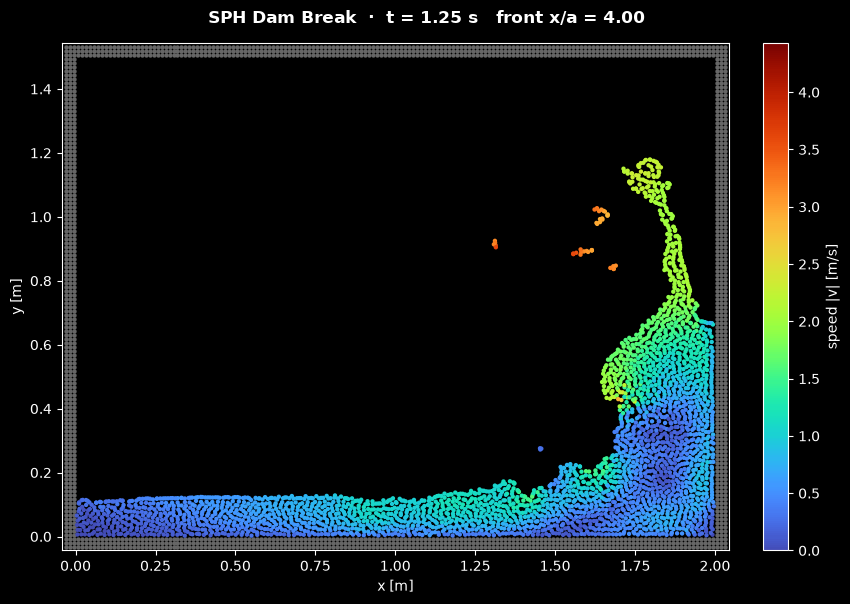

# SPH Dam Break

This script simulates the collapse of a water column in a closed tank, the classic dam-break problem, with weakly compressible smoothed particle hydrodynamics (SPH), and animates the water particles coloured by their speed. SPH follows the fluid as a set of particles that carry mass, density and velocity, so the free surface, the jet up the far wall and the plunging breaker need no mesh and no interface tracking.

## Overview

- **Setup**: a column $a = 0.5$ m wide and $2a = 1$ m high stands at rest against the left wall of a tank $4a = 2$ m wide, with $g = 9.81$ m/s² and $\rho_0 = 1000$ kg/m³. A lid at $3a = 1.5$ m closes the tank: it catches the thin jet that shoots up the far wall, which along a frictionless wall would otherwise climb several metres.
- **Particles**: 40 × 80 = 3200 fluid particles start on a square lattice with spacing $\Delta p = 12.5$ mm, each with mass $`\rho_0\,\Delta p^2`$ and the hydrostatic density of its depth. The smoothing length is $`h = 1.3\,\Delta p`$, and 1716 fixed wall particles in three layers form the floor, the lid and the side walls.
- **Model**: cubic-spline kernel, continuity equation for the density, Tait equation of state with an artificial speed of sound $c_0 = 44$ m/s, Monaghan's artificial viscosity with $\alpha = 0.05$, and gravity.
- **Walls**: dummy particles whose pressure is extrapolated from the nearby fluid (Adami et al., 2012). They push the water but never pull it, so spray cannot stick to them.
- **Time stepping**: kick-drift-kick leapfrog with a step set by the sound speed and the largest acceleration, about 80 µs. A Numba cell list finds the neighbours, and the forces are compiled with Numba.
- **Display**: each fluid particle is a dot coloured by its speed, from 0 to the free-fall speed $\sqrt{2g\cdot 2a} = 4.4$ m/s, with the `turbo` colour map without its darkest blues, so that water at rest stays visible on black. The wall particles are grey. Each frame advances 48 time steps (about 4 ms), and the default 560 frames reach $t = 2.2$ s.
- **Reel**: `--reel FILE` renders the run as a 1080 × 1920 MP4 for YouTube Shorts or Instagram Reels.

## Mathematical Background

### SPH Interpolation

A field $A$ is approximated by a weighted sum over the particles $j$ near a point, each standing for a volume $m_j/\rho_j$:

```math
A(\mathbf{r}) \approx \sum_j \frac{m_j}{\rho_j}\, A_j\,
W(|\mathbf{r} - \mathbf{r}_j|, h),
\qquad \nabla A(\mathbf{r}) \approx \sum_j \frac{m_j}{\rho_j}\, A_j\, \nabla
W(|\mathbf{r} - \mathbf{r}_j|, h)
```

The kernel is the cubic spline, which is normalised to 1 in 2D and vanishes beyond $2h$. With $q = r/h$,

$$
W(q) = \frac{10}{7\pi h^2}
\begin{cases}
1 - \tfrac32 q^2 + \tfrac34 q^3, & 0 \le q < 1 \\
\tfrac14 (2 - q)^3, & 1 \le q < 2 \\
0, & q \ge 2
\end{cases}
$$

With $`h = 1.3\,\Delta p`$ each particle has about 20 neighbours.

### Equations of Motion

Each particle moves with the flow, $`d\mathbf{r}_i/dt = \mathbf{v}_i`$. Writing $`\nabla_i W_{ij}`$ for the gradient of $W(|\mathbf{r}_i - \mathbf{r}_j|, h)$ with respect to $`\mathbf{r}_i`$ and $`\mathbf{v}_{ij} = \mathbf{v}_i - \mathbf{v}_j`$, the density and the velocity change as

```math
\frac{d\rho_i}{dt} = \sum_j m_j\, \mathbf{v}_{ij}\cdot\nabla_i W_{ij},
\qquad \frac{d\mathbf{v}_i}{dt} = -\sum_j
m_j\left(\frac{p_i}{\rho_i^2} + \frac{p_j}{\rho_j^2} + \Pi_{ij}\right)\nabla_i W_{ij} +
\mathbf{g}
```

These are the continuity and Euler equations in the symmetric form of Monaghan (1994). The force between two particles acts along the line joining them and is equal and opposite on the pair, so the fluid forces conserve linear and angular momentum exactly, up to round-off.

### Weakly Compressible Equation of State

The pressure follows from the density through the Tait equation,

$$
p = B\left[\left(\frac{\rho}{\rho_0}\right)^{\gamma} - 1\right],
\qquad B = \frac{\rho_0 c_0^2}{\gamma},
\qquad \gamma = 7
$$

Real water has $c \approx 1500$ m/s, which would need a time step about 35 times smaller. The density changes by roughly $(v/c_0)^2$, so a speed of sound ten times the largest flow speed keeps them near 1 %. Here $c_0 = 10\sqrt{2g\cdot 2a} = 44$ m/s, ten times the free-fall speed from the top of the column. Throughout the default run 99 % of the particles stay within 2 % of $\rho_0$. Only while the jet spreads along the lid, from $t = 0.68$ s on, do up to 16 particles at its tip reach between $-14$ % and $+11$ %. The initial densities are set so that $`p = \rho_0 g\,(2a - y)`$, the hydrostatic pressure.

### Artificial Viscosity

```math
\Pi_{ij} = \begin{cases}
-\dfrac{\alpha c_0 \mu_{ij}}{\bar\rho_{ij}}, & \mathbf{v}_{ij}\cdot\mathbf{r}_{ij} < 0 \\
0, & \text{otherwise}
\end{cases}
\qquad
\mu_{ij} = \frac{h\,\mathbf{v}_{ij}\cdot\mathbf{r}_{ij}}{r_{ij}^2 + 0.01 h^2},
\qquad \bar\rho_{ij} = \frac{\rho_i + \rho_j}{2}
```

The term acts only between approaching particles. It damps the acoustic noise of the weakly compressible model and keeps particles from passing through each other in impacts. In 2D it acts like a kinematic viscosity of about $\alpha h c_0/8$ (Monaghan, 2005), here 0.0045 m²/s. That is thousands of times the viscosity of water, so the simulated flow is smoother than a real one of this size.

### Walls

Three layers of fixed dummy particles cover the kernel support $`2h = 2.6\,\Delta p`$ behind the floor, the lid and the side walls. Their pressure is extrapolated from the fluid particles $f$ around each wall particle $w$ (Adami et al., 2012):

$$
p_w = \frac{\sum_f p_f W_{wf} + \mathbf{g}\cdot\sum_f \rho_f (\mathbf{r}_w - \mathbf{r}_f) W_{wf}}{\sum_f W_{wf}}
$$

The second term adds the hydrostatic pressure difference between the fluid and the wall particle, so a column at rest presses on the floor with $\rho_0 g$ times its depth. The wall density follows from inverting the Tait equation, and the wall particles enter the sums above with zero velocity. Water near a wall gets denser as it approaches and is pushed back. Negative wall pressures are set to zero, and so is the fluid pressure in fluid-wall pairs: the walls push but never pull. Without this, droplets of spray hang on the walls held by the slight suction at the free surface.

### Time Stepping

Each step is a kick-drift-kick leapfrog:

```math
\mathbf{v}^{n+1/2} = \mathbf{v}^n + \frac{\Delta t}{2}\,\mathbf{a}^n,
\qquad \mathbf{r}^{n+1} = \mathbf{r}^n + \Delta t\,\mathbf{v}^{n+1/2},
\qquad \mathbf{v}^{n+1} = \mathbf{v}^{n+1/2} + \frac{\Delta t}{2}\,\mathbf{a}^{n+1}
```

The density takes the same two half steps with $d\rho/dt$. The rates at the new positions depend on the velocity and density through the viscosity and the pressure, so they are evaluated with the values predicted by a second half step with the old rates. Each step thus needs one force evaluation. The step size is

```math
\Delta
t = \min\left(0.25\, \frac{h}{c_0 + \max_i |\mathbf{v}_i|},\ 0.25
\sqrt{\frac{h}{\max_i |\mathbf{a}_i|}}\right)
```

so that a sound wave crosses at most a quarter of a smoothing length per step, and the acceleration alone moves a particle by at most $h/32$.

### Neighbour Search

The particles are sorted into square cells of side $2h$ by a counting sort. All neighbours of a particle then lie in its own cell and the eight around it, so a step costs time proportional to the number of particles, not its square.

## Implementation

- `kernel` and `kernel_derivative` evaluate $W$ and $dW/dr$. `tait_pressure` and `tait_density` are the equation of state and its inverse.
- `build_cells(x, y, grid)` sorts the particles into cells. `compute_rates(...)` first sets the wall pressures and densities, then loops over fluid-fluid and fluid-wall pairs and returns the accelerations, the density rates and all pressures. These are Numba functions.
- `lattice` and `hydrostatic_density` build the initial particles.
- `SPHDamBreakSimulation(particles_across, column_width, column_height, tank_width, tank_height)` derives from the shared `Simulation` class in [`scripts/_animation.py`](../../_animation.py). The arrays `x`, `y`, `vx`, `vy`, `rho` and `pressure` hold the `n_fluid` fluid particles first, then the wall particles. `step()` performs one leapfrog step with the size from `stable_time_step()` and adds it to the time, since the step size varies. `speed` and `surge_front()` (the leading edge of the water on the floor) are derived from the state. A tank as wide as the column (`tank_width=column_width`) holds a column at rest.
- `DamBreakView` draws the fluid particles as an `EllipseCollection` of circles 1.1 $\Delta p$ across in data units, so that the water looks the same in the window, the PNG and the reel. Each frame updates the circle positions and colours instead of creating new artists. The wall particles are a second, static collection.
- Parameters are module constants: `COLUMN_WIDTH`, `COLUMN_HEIGHT`, `TANK_WIDTH`, `TANK_HEIGHT`, `PARTICLES_ACROSS`, `SMOOTHING_RATIO`, `SOUND_SPEED`, `VISCOSITY_ALPHA`, `WALL_LAYERS`, `CFL_NUMBER`, `FORCE_NUMBER`, `STEPS_PER_FRAME` and `N_FRAMES`.

The tests check that:

- the kernel integrates to 1, its sum over a particle lattice is within 0.2 % of 1, and `kernel_derivative` matches a finite difference of `kernel`;
- on a lattice the kernel gradients cancel, and $`-\sum_j (\mathbf{r}_i - \mathbf{r}_j)\otimes\nabla_i W_{ij}\,\Delta p^2`$ is the identity to within 3 %;
- a free patch of particles with random velocities and densities keeps its total linear and angular momentum to round-off over 200 steps;
- a column held in a tank as wide as itself stays at rest, with pressures within 1.5 % RMS (3 % at most) of $\rho_0 g$ times the depth;
- in a coarse dam break the energy (kinetic, potential and elastic) never rises more than 0.5 % above its initial value and falls as viscosity dissipates it. The surge front advances until it hits the far wall without overtaking the shallow-water front $`a + 2\sqrt{g\cdot 2a}\,t`$ of Ritter's solution, and no particle leaves the tank.

## Usage

```bash
python main.py                                    # animate in a window (space pauses)
python main.py --no-show --output . --steps 320   # save the frame at t = 1.25 s as a PNG
python main.py --reel reel.mp4                    # 30 s vertical video for Shorts/Reels
```

`--steps N` sets the number of frames; each frame is 48 leapfrog time steps (about 4 ms). One time step takes about 2 ms, so the default 560 frames take about a minute to compute, and a full reel about 2 minutes.

## Output



The image shows the tank at $t = 1.25$ s, after 320 frames:

- **Floor layer**: the column has drained completely. A layer about 10 cm deep covers the floor and moves slowly (blue).
- **Jet**: the water that shot up the right wall reached the lid and is now falling back. Its thin tip (green, about 2 m/s) curls away from the wall at about 1.1 m height, and loose droplets of spray (orange, about 3 m/s) fly beside it.
- **Breaker**: the water piled against the wall bulges to the left at half a metre height. This bulge overturns into a plunging breaker and falls back onto the floor layer.
- **Walls**: the grey dots are the three layers of dummy particles that form the floor, the lid and the side walls.

The reel starts with the column at rest. The surge runs along the floor and hits the far wall after about 0.5 s, and a jet climbs to the lid by 0.7 s. The breaker plunges back, and the wave it sends to the left climbs and curls over at the left wall at the end of the run.

## Related Notes

- [Eulerian and Lagrangian descriptions of flow](../../../notes/fluid_mechanics/flow_kinematics/eulerian_lagrangian_flows.md)
- [Pressure and compressibility (low-Mach flows)](../../../notes/fluid_mechanics/fluid_properties/pressure_and_compressibility.md)
- [Hydrostatics](../../../notes/fluid_mechanics/fluid_statics/hydrostatics.md)
- [Navier-Stokes equations](../../../notes/fluid_mechanics/governing_equations/navier_stokes.md)
