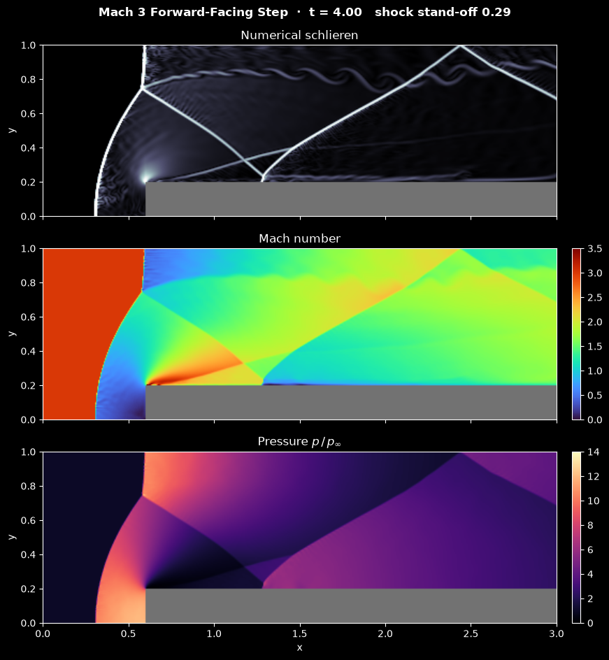

# Supersonic Forward-Facing Step

This script solves the 2D compressible Euler equations for a Mach 3 stream that meets a forward-facing step in a wind tunnel, the benchmark of Woodward and Colella (1984), and animates the shock pattern that forms. A finite-volume scheme with MUSCL reconstruction, HLLC fluxes and two-stage Runge-Kutta time stepping captures the bow shock in front of the step, its Mach reflection at the top wall, the slip line that rolls up behind the triple point, and the shocks that bounce down the tunnel. The animation shows a numerical schlieren image above the Mach number and the pressure.

## Overview

- **Problem**: a tunnel of length 3 and height 1 with a step of height 0.2 whose face is at $x = 0.6$. Gas with $\gamma = 1.4$ enters on the left with $\rho = 1.4$, $u = 3$, $v = 0$, $p = 1$, so the sound speed is 1 and the Mach number 3. At $t = 0$ the whole tunnel holds the inflow state.
- **Boundaries**: prescribed inflow on the left, zero-gradient outflow on the right (the flow leaves supersonically), and reflecting walls at the top, at the bottom and around the step.
- **Grid**: 480 × 160 square cells of size $1/160$ (`CELLS_PER_UNIT`). The step occupies the last 384 columns of the lowest 32 rows.
- **Scheme**: cell-centred finite volumes. Density, velocity and pressure are reconstructed linearly with the monotonised-central (MC) limiter, the HLLC approximate Riemann solver gives the face fluxes, and Heun's method (SSP-RK2) advances in time.
- **Time step**: fixed, $\Delta t = 4\times10^{-4}$, so frames are evenly spaced in time. Every step checks the CFL number and splits itself into equal sub-steps if it would exceed 0.45. In the default run the 10 000 time steps take 10 663 Runge-Kutta steps; most of the extra ones fall in the first 1.5 time units, while the bow shock forms.
- **Corner**: the reconstruction falls back to first order where it would produce a negative density or pressure, and a density and pressure floor of $10^{-6}$ stands behind it. The floor is never reached in the default run, so the scheme stays exactly conservative.
- **Animation**: 400 frames of 25 time steps reach $t = 4$. The three stacked panels are a numerical schlieren image (bright where the density changes steeply), the Mach number, and the pressure, all with fixed colour scales; the step is grey. The status line shows the time and the stand-off distance of the bow shock from the step face.
- **Speed**: the flux, primitive-variable and CFL kernels are compiled with Numba and run in parallel. The 10 000 time steps took 90 s on a 20-core desktop CPU shared with other jobs.
- **Reel**: `--reel FILE` renders the run as a 1080 × 1920 MP4 for YouTube Shorts or Instagram Reels.

## Mathematical Background

### Euler Equations

Inviscid compressible flow conserves mass, momentum and energy:

```math
\frac{\partial \mathbf{U}}{\partial t} + \frac{\partial \mathbf{F}}{\partial x} + \frac{\partial \mathbf{G}}{\partial y} = 0,
\qquad
\mathbf{U} = \begin{pmatrix} \rho \\ \rho u \\ \rho v \\ E \end{pmatrix},
\quad
\mathbf{F} = \begin{pmatrix} \rho u \\ \rho u^2 + p \\ \rho u v \\ (E + p)u \end{pmatrix},
\quad
\mathbf{G} = \begin{pmatrix} \rho v \\ \rho u v \\ \rho v^2 + p \\ (E + p)v \end{pmatrix}
```

with the ideal-gas closure $p = (\gamma - 1)\left(E - \tfrac12\rho(u^2 + v^2)\right)$ and sound speed $c = \sqrt{\gamma p/\rho}$.

### Finite-Volume Update

The cell average $\mathbf{U}_{i,j}$ changes by the fluxes through its four faces:

$$
\frac{d\mathbf{U}_{i,j}}{dt} = -\frac{\mathbf{F}_{i+1/2,j} - \mathbf{F}_{i-1/2,j}}{\Delta x} - \frac{\mathbf{G}_{i,j+1/2} - \mathbf{G}_{i,j-1/2}}{\Delta y}
$$

Each face flux is computed once and added to one cell and subtracted from its neighbour, so mass, momentum and energy are conserved to round-off.

### MUSCL Reconstruction

Each primitive variable $`q \in \{\rho, u, v, p\}`$ is extrapolated from the cell centre to the face with a limited slope. At the face between cells $i$ and $i+1$:

```math
q^L_{i+1/2} = q_i + \tfrac12\,\phi(q_i - q_{i-1},\ q_{i+1} - q_i),
\qquad q^R_{i+1/2} = q_{i+1} - \tfrac12\,\phi(q_{i+1} - q_i,\ q_{i+2} - q_{i+1})
```

The monotonised-central limiter is

$$
\phi(a, b) =
\begin{cases}
0, & ab \le 0, \\
\mathrm{sign}(a)\min\left(2|a|,\ 2|b|,\ \tfrac12|a + b|\right), & ab > 0,
\end{cases}
$$

so the slope vanishes at extrema and the scheme does not create new oscillations at shocks.

### HLLC Flux

The HLLC solver of Toro, Spruce and Speares (1994) approximates the Riemann problem at each face by two outer waves and a contact wave. With $u$ the velocity normal to the face, the outer wave speeds are $S_L = \min(u_L - c_L,\ u_R - c_R)$ and $S_R = \max(u_L + c_L,\ u_R + c_R)$, and the contact moves at

$$
S_* = \frac{p_R - p_L + \rho_L u_L (S_L - u_L) - \rho_R u_R (S_R - u_R)}{\rho_L (S_L - u_L) - \rho_R (S_R - u_R)}
$$

The flux is $\mathbf{F}_L$ if $S_L \ge 0$, $\mathbf{F}_R$ if $S_R \le 0$, and otherwise $`\mathbf{F}_K + S_K(\mathbf{U}_{*K} - \mathbf{U}_K)`$ on the side $K$ of the contact that contains the face, with the star state

```math
\mathbf{U}_{*K} = \rho_K \frac{S_K - u_K}{S_K - S_*}
\begin{pmatrix} 1 \\ S_* \\ v_K \\ \dfrac{E_K}{\rho_K} + (S_* - u_K)\left(S_* + \dfrac{p_K}{\rho_K (S_K - u_K)}\right) \end{pmatrix}
```

Unlike the simpler HLL flux, HLLC resolves contact discontinuities and slip lines sharply, which lets the slip line roll up.

### Time Stepping and CFL Condition

With $L(\mathbf{U})$ the right-hand side of the finite-volume update, Heun's method

```math
\mathbf{U}^{(1)} = \mathbf{U}^n + \Delta t\, L(\mathbf{U}^n),
\qquad \mathbf{U}^{n+1} = \tfrac12 \mathbf{U}^n +
\tfrac12\left(\mathbf{U}^{(1)} + \Delta t\, L(\mathbf{U}^{(1)})\right)
```

is a convex combination of forward-Euler steps, so it keeps the non-oscillatory property of the spatial scheme (Gottlieb and Shu, 1998). The time step obeys

$$
\mathrm{CFL} = \Delta t
\max_{i,j}\left(\frac{|u| + c}{\Delta x} + \frac{|v| + c}{\Delta y}\right) \le 0.45
$$

The largest signal speeds occur around the corner of the step, where the flow turns quickly and the sum above reaches about 6.5.

### Boundary Conditions

Two layers of ghost cells surround the grid. Inflow ghosts hold the inflow state, outflow ghosts copy the last column, and wall ghosts mirror the fluid cells next to the wall with the normal velocity reversed, which makes the mass flux through the wall vanish. The step uses separate ghost values for the two directions: for the fluxes normal to $x$, the two solid columns behind the step face mirror the two fluid columns in front of it, and for the fluxes normal to $y$, the two solid rows under the top of the step mirror the two fluid rows above it.

### Flow Features

- **Bow shock**: the step blocks the supersonic stream, so a detached shock forms in front of it. Near the bottom wall it is a normal shock, behind which the gas comes to rest in the corner in front of the step at the Rayleigh pitot pressure

  ```math
  \frac{p_0}{p_\infty} = \left(\frac{(\gamma + 1)^2 M^2}{4\gamma M^2 - 2(\gamma - 1)}\right)^{\gamma/(\gamma - 1)} \frac{1 - \gamma + 2\gamma M^2}{\gamma + 1} = 12.06 \quad (M = 3)
  ```

- **Mach reflection**: where the bow shock meets the top wall it first reflects regularly. As the shock moves upstream it meets the wall more steeply, and the reflection turns into a Mach reflection: a nearly normal Mach stem forms at the wall and meets the incident and reflected shocks at a triple point.

- **Slip line**: gas that passed the Mach stem and gas that passed the two weaker shocks have the same pressure but different velocities and entropies. The slip line between them is unstable (Kelvin-Helmholtz) and rolls up; without viscosity the roll-ups are seeded by numerical errors, so their details depend on the grid.

- **Expansion at the corner**: the flow turns around the corner of the step through an expansion fan centred on a single point.

### Corner Singularity

At the corner the exact solution has a singular expansion, and every scheme on a Cartesian grid produces errors there: a thin layer of low density and high entropy along the top of the step (a numerical boundary layer), which also changes how the reflected shock meets the top of the step. Woodward and Colella (1984) reduced these errors by resetting the density and velocity in the cells next to the corner. This script does not modify the solution there; it only guards positivity, by falling back to first-order reconstruction where the limited slopes would give a negative density or pressure and by flooring both at $10^{-6}$. `floored_cells` counts the floored cells; it stays zero in the default run.

## Implementation

- `Domain` describes the grid, the step (`step_i`, `step_j` in cells) and the boundary types; `make_tunnel(cells_per_unit)` builds the Woodward-Colella tunnel.
- `fill_primitives` (Numba, parallel) converts the conservative state to primitives directly into two padded arrays, and `fill_ghosts_x` and `fill_ghosts_y` fill their ghost cells for the faces normal to $x$ and to $y$. `padded_primitives` combines them.
- `limited_slope`, `face_value`, `hllc_flux` and `muscl_hllc` implement the reconstruction and the HLLC flux of one face. `flux_divergence` (Numba, parallel) computes all face fluxes and their divergence, and `euler_rhs` returns $L(\mathbf{U})$, zero inside the step.
- `max_signal_rate` gives the CFL rate, `apply_floors` the positivity floors, `ssp_rk2_step` one Heun step, and `advance_cfl(state, dt, domain)` advances by `dt` in as many equal Heun steps as the CFL limit requires.
- `ForwardStepSimulation(cells_per_unit, dt)` derives from the shared `Simulation` class in [`scripts/_animation.py`](../../_animation.py). It holds the conservative `state` (4 × rows × columns); `step()` calls `advance_cfl` once. `field(name)` returns density, pressure or Mach number, `schlieren()` the numerical schlieren image $\exp(-|\nabla\rho|/40)$ with central differences that use the same mirrored ghost cells, and `standoff()` the distance of the bow shock from the step face along the bottom wall.
- `ForwardStepView` stacks the three `imshow` panels with `bone_r`, `turbo` and `magma` colour maps on fixed scales (`SCHLIEREN_SCALE`, `MACH_LIMITS`, `PRESSURE_LIMITS`).
- Parameters are module constants: `GAMMA`, `INFLOW`, `STEP_X`, `STEP_HEIGHT`, `CELLS_PER_UNIT`, `CFL`, `END_TIME`, `N_FRAMES` and `STEPS_PER_FRAME`.

The numerical tests in `tests/test_new_supersonic_forward_facing_step.py` run the same solver on Sod's shock tube (along $x$ and along $y$) against the exact Riemann solution, check that uniform supersonic flow and gas at rest around the step stay unchanged, that mass, momentum and energy are conserved in periodic and closed boxes, and that the pressure in the corner in front of the step matches the pitot pressure above.

## Usage

```bash
python main.py                                    # animate in a window (space pauses)
python main.py --no-show --output . --steps 400   # save the final frame as a PNG
python main.py --reel reel.mp4                    # 30 s vertical video for Shorts/Reels
```

`--steps N` sets the number of frames; each frame is 25 time steps of $\Delta t = 4\times10^{-4}$, and the default 400 frames reach $t = 4$.

## Output



The image shows the flow at $t = 4$, the time of the published comparisons:

- **Bow shock**: it stands 0.29 in front of the step face at the bottom wall and curves up to the top wall. Behind its normal part the gas is subsonic (blue in the Mach panel) and the pressure rises to the pitot value of about 12 at the step face.
- **Mach stem and triple point**: at the top wall the bow shock turns into a short, nearly vertical Mach stem at $x \approx 0.6$, which meets the reflected shock at a triple point near $(0.58, 0.75)$.
- **Slip line**: from the triple point a slip line runs downstream along $y \approx 0.8$ and rolls up into a row of small Kelvin-Helmholtz vortices, visible in the schlieren image.
- **Reflections**: the reflected shock hits the top of the step at $x \approx 1.28$ and reflects again, reaching the top wall near $x \approx 2.44$.
- **Corner**: the expansion fan around the corner accelerates the flow to the highest Mach numbers in the tunnel (red), and a thin numerical entropy layer runs along the top of the step.

The reel starts with the uniform Mach 3 stream slamming into the step: a curved shock bounces off the step face, moves upstream and grows until it reaches the top wall near $t = 1$. The reflection there is regular at first and turns into a Mach reflection around $t = 2$; the Mach stem then moves upstream and the slip line behind the triple point rolls up, while the reflected shocks zig-zag down the tunnel.

## Related Notes

- [Shock waves and expansion fans](../../../notes/fluid_mechanics/compressible_flow/shock_waves.md)
- [Compressible flow](../../../notes/fluid_mechanics/compressible_flow/README.md)
- [Finite-volume discretization](../../../notes/numerical/fvm/discretization.md)
- [Numerical stability](../../../notes/numerical/cfd/numerical_stability.md)
